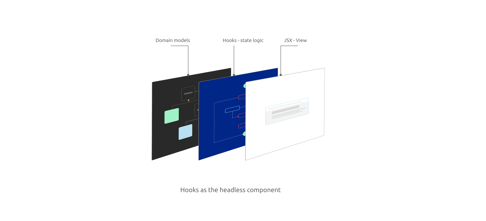
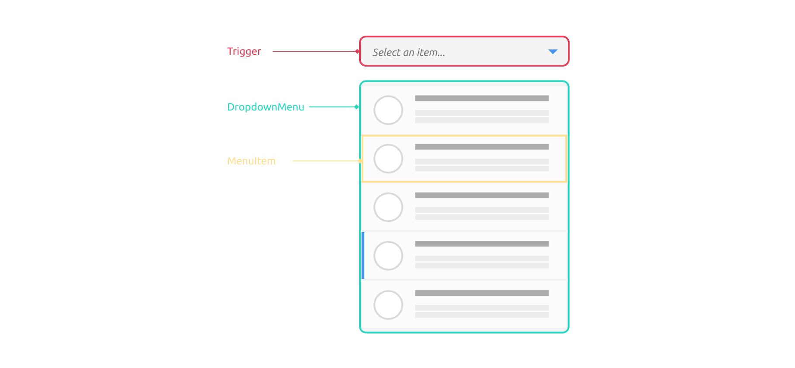
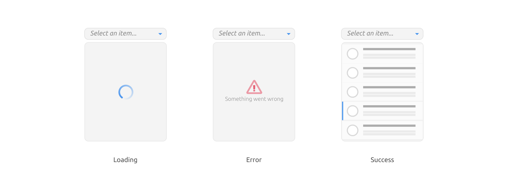

# Headless Component: a pattern for composing React UIs

React has revolutionized the way we think about UI components and state management in UI. But with every new feature request or enhancement, a seemingly simple component can quickly evolve into a complex amalgamation of intertwined state and UI logic.

Imagine building a simple dropdown list. Initially, it appears straightforward – you manage the open/close state and design its appearance. But, as your application grows and evolves, so do the requirements for this dropdown:

1. **Accessibility Support**: Ensuring your dropdown is usable for everyone, including those using screen readers or other assistive technologies, adds another layer of complexity. You need to manage focus states, `aria` attributes, and ensure your dropdown is semantically correct.
  
2. **Keyboard Navigation**: Users shouldn’t be limited to mouse interactions. They might want to navigate options using arrow keys, select using `Enter`, or close the dropdown using `Escape`. This requires additional event listeners and state management.
  
3. **Async Data Considerations**: As your application scales, maybe the dropdown options aren't hardcoded anymore. They might be fetched from an API. This introduces the need to manage loading, error, and empty states within the dropdown.
  
4. **UI Variations and Theming**: Different parts of your application might require different styles or themes for the dropdown. Managing these variations within the component can lead to an explosion of props and configurations.
  
5. **Extending Features**: Over time, you might need additional features like multi-select, filtering options, or integration with other form controls. Adding these to an already complex component can be daunting.

Each of these considerations adds layers of complexity to our dropdown component. Mixing state, logic, and UI presentation makes it less maintainable and limits its reusability. The more intertwined they become, the harder it gets to make changes without unintentional side effects.

## Introducing the Headless Component Pattern

Facing these challenges head-on, the Headless Component pattern offers a way out. It emphasizes the separation of the calculation from the UI representation, giving developers the power to build versatile, maintainable, and reusable components.

A headless component is a design pattern in React where a component - normally inplemented as React hooks - is responsible solely for logic and state management without prescribing any specific UI (User Interface). It provides the "brains" of the operation but leaves the "looks" to the developer implementing it. In essence, it offers functionality without forcing a particular visual representation.

When visualized, the headless component appears as a slender layer interfacing with JSX views on one side, and communicating with underlying data models on the other when required. This pattern is particularly beneficial for individuals seeking solely the behavior or state management aspect of the UI, as it conveniently segregates these from the visual representation.



For instance, consider a headless dropdown component. It would handle state management for open/close states, item selection, keyboard navigation, etc. When it's time to render, instead of rendering its own hardcoded dropdown UI, it provides this state and logic to a child function or component, letting the developer decide how it should visually appear.

In this article, we'll delve into a practical example by constructing a complex component—a dropdown list from the ground up. As we add more features to the component, we'll observe the challenges that arise. Through this, we'll demonstrate how the Headless Component pattern can address these challenges, compartmentalize distinct concerns, and aid us in crafting more versatile components.

## Implementing a Dropdown List

A dropdown list is a common component used in many places. Although there's a native select component for basic use cases, a more advanced version offering more control over each option provides a better user experience.



Creating one from scratch, a complete implementation, requires more effort than it appears at first glance. It's essential to consider keyboard navigation, accessibility (for instance, screen reader compatibility), and usability on mobile devices, among others.

We'll begin with a simple, desktop version that only supports mouse clicks, and gradually build in more features to make it realistic. Note that the goal here is to reveal a few software design patterns rather than teach how to build a dropdown list for production use - actually, I don’t recommend doing this from scratch and would instead suggest using more mature libraries.

Basically, we need an element (let's call it a trigger) for the user to click, and a state to control the show and hide actions of a list panel. Initially, we hide the panel, and when the trigger is clicked, we show the list panel.

```jsx
import { useState } from "react";

interface Item {
  icon: string;
  text: string;
  description: string;
}

type DropdownProps = {
  items: Item[];
};

const Dropdown = ({ items }: DropdownProps) => {
  const [isOpen, setIsOpen] = useState(false);
  const [selectedItem, setSelectedItem] = useState<Item | null>(null);

  return (
    <div className="dropdown">
      <div className="trigger" tabIndex={0} onClick={() => setIsOpen(!isOpen)}>
        <span className="selection">
          {selectedItem ? selectedItem.text : "Select an item..."}
        </span>
      </div>
      {isOpen && (
        <div className="dropdown-menu">
          {items.map((item, index) => (
            <div
              key={index}
              onClick={() => setSelectedItem(item)}
              className="item-container"
            >
              
              <div className="details">
                <div>{item.text}</div>
                <small>{item.description}</small>
              </div>
            </div>
          ))}
        </div>
      )}
    </div>
  );
};
```

In the code above, we've set up the basic structure for our dropdown component. Using the `useState` hook, we manage the `isOpen` and `selectedItem` states to control the dropdown's behavior. A simple click on the trigger toggles the dropdown menu, while selecting an item updates the `selectedItem` state.

Let's break down the component into smaller, manageable pieces to see it more clearly. This decomposition isn't part of the Headless Component pattern, but breaking a complex UI component into pieces is a valuable activity. 

We can start by extracting a `Trigger` component to handle user clicks:

```tsx
const Trigger = ({
  label,
  onClick,
}: {
  label: string;
  onClick: () => void;
}) => {
  return (
    <div className="trigger" tabIndex={0} onClick={onClick}>
      <span className="selection">{label}</span>
    </div>
  );
};
```

The `Trigger` component is a basic clickable UI element, taking in a `label` to display and an `onClick` handler. It remains agnostic to its surrounding context. Similarly, we can extract a `DropdownMenu` component to render the list of items:

```tsx
const DropdownMenu = ({
  items,
  onItemClick,
}: {
  items: Item[];
  onItemClick: (item: Item) => void;
}) => {
  return (
    <div className="dropdown-menu">
      {items.map((item, index) => (
        <div
          key={index}
          onClick={() => onItemClick(item)}
          className="item-container"
        >
          
          <div className="details">
            <div>{item.text}</div>
            <small>{item.description}</small>
          </div>
        </div>
      ))}
    </div>
  );
};
```

The `DropdownMenu` component displays a list of items, each with an icon and a description. When an item is clicked, it triggers the provided `onItemClick` function with the selected item as its argument.

And then Within the `Dropdown` component, we incorporate `Trigger` and `DropdownMenu` and supply them with the necessary state. This approach ensures that the `Trigger` and `DropdownMenu` components remain state-agnostic and purely react to passed props.

```tsx
const Dropdown = ({ items }: DropdownProps) => {
  const [isOpen, setIsOpen] = useState(false);
  const [selectedItem, setSelectedItem] = useState<Item | null>(null);

  return (
    <div className="dropdown">
      <Trigger
        label={selectedItem ? selectedItem.text : "Select an item..."}
        onClick={() => setIsOpen(!isOpen)}
      />
      {isOpen && <DropdownMenu items={items} onItemClick={setSelectedItem} />}
    </div>
  );
};
```

In this updated code structure, we've separated concerns by creating specialized components for different parts of the dropdown, making the code more organized and easier to manage. 


As depicted in the image above, you can click the "Select an item..." trigger to open the dropdown. Selecting a value from the list updates the displayed value and subsequently closes the dropdown menu. 

At this point, our refactored code is clear-cut, with each segment being straightforward and adaptable. Modifying or introducing a different `Trigger` component would be relatively straightforward. However, as we introduce more features and manage additional states, will our current components hold up?

Let's find out with a a crucial enhancement for a serious dopdown list: keyboard navigation.

## Implementing Keyboard Navigation

Incorporating keyboard navigation within our dropdown list enhances the user experience by providing an alternative to mouse interactions. This is particularly important for accessibility and offers a seamless navigation experience on the web page. Let's explore how we can achieve this using the `onKeyDown` event handler.

Initially, we'll attach a `handleKeyDown` function to the `onKeyDown` event in our `Dropdown` component. Here, we utilize a switch statement to determine the specific key pressed and perform actions accordingly. For instance, when the "Enter" or "Space" key is pressed, the dropdown is toggled. Similarly, the "ArrowDown" and "ArrowUp" keys allow navigation through the list items, cycling back to the start or end of the list when necessary.

```tsx
const Dropdown = ({ items }: DropdownProps) => {
  // ... previous state variables ...
  const [selectedIndex, setSelectedIndex] = useState<number>(-1);

  const handleKeyDown = (e: React.KeyboardEvent) => {
    switch (e.key) {
      // ... case blocks ...
      // ... handling Enter, Space, ArrowDown and ArrowUp ...
    }
  };

  return (
    <div className="dropdown" onKeyDown={handleKeyDown}>
      {/* ... rest of the JSX ... */}
    </div>
  );
};
```

Additionally, we have updated our `DropdownMenu` component to accept a `selectedIndex` prop. This prop is used to apply a highlighted CSS style and set the `aria-selected` attribute to the currently selected item, enhancing the visual feedback and accessibility.

```jsx
const DropdownMenu = ({
  items,
  selectedIndex,
  onItemClick,
}: {
  items: Item[];
  selectedIndex: number;
  onItemClick: (item: Item) => void;
}) => {
  return (
    <div className="dropdown-menu" role="listbox">
      {/* ... rest of the JSX ... */}
    </div>
  );
};
```

To address this, we'll introduce the concept of a headless component via a custom hook named `useDropdown`. This hook efficiently wraps up the state and keyboard event handling logic, returning an object filled with essential states and functions. By de-structuring this in our `Dropdown` component, we keep our code neat and sustainable. 

The magic lies in the `useDropdown` hook, our protagonist—the headless component. This versatile unit houses everything a dropdown needs: whether it's open, the selected item, the highlighted item, reactions to the Enter key, and so forth. The beauty is its adaptability; you can pair it with various visual presentations—your JSX elements.

```jsx
const useDropdown = (items: Item[]) => {
  // ... state variables ...

  // helper function can return some aria attribute for UI
  const getAriaAttributes = () => ({
    role: "combobox",
    "aria-expanded": isOpen,
    "aria-activedescendant": selectedItem ? selectedItem.text : undefined,
  });

  const handleKeyDown = (e: React.KeyboardEvent) => {
    // ... switch statement ...
  };
  
  const toggleDropdown = () => setIsOpen((isOpen) => !isOpen);

  return {
    isOpen,
    toggleDropdown,
    handleKeyDown,
    selectedItem,
    setSelectedItem,
    selectedIndex,
  };
};
```

Now, our `Dropdown` component is simplified, shorter and easier to understand. It leverages the `useDropdown` hook to manage its state and handle keyboard interactions, demonstrating a clear separation of concerns and making the code easier to understand and manage.

```jsx
const Dropdown = ({ items }: DropdownProps) => {
  const {
    isOpen,
    selectedItem,
    selectedIndex,
    toggleDropdown,
    handleKeyDown,
    setSelectedItem,
  } = useDropdown(items);

  return (
    <div className="dropdown" onKeyDown={handleKeyDown}>
      <Trigger
        onClick={toggleDropdown}
        label={selectedItem ? selectedItem.text : "Select an item..."}
      />
      {isOpen && (
        <DropdownMenu
          items={items}
          onItemClick={setSelectedItem}
          selectedIndex={selectedIndex}
        />
      )}
    </div>
  );
};
```

Through these modifications, we have successfully implemented keyboard navigation in our dropdown list, making it more accessible and user-friendly. This example also illustrates how hooks can be utilized to manage complex state and logic in a structured and modular manner, paving the way for further enhancements and feature additions to our UI components.

The beauty of this design lies in its distinct separation of logic from presentation. By 'logic', we refer to the core functionalities of a `select` component: the open/close state, the selected item, the highlighted element, and the reactions to user inputs like pressing the ArrowDown when choosing from the list. This division ensures that our component retains its core behavior without being bound to a specific visual representation, justifying the term "headless component".
## Testing the Headless Component

The logic of our component is centralized, enabling its reuse in diverse scenarios. It's crucial for this functionality to be reliable. Thus, comprehensive testing becomes imperative. The good news is, testing such behavior is straightforward.

We can evaluate state management by invoking a public method and observing the corresponding state change. For instance, we can examine the relationship between `toggleDropdown` and the `isOpen` state.

```tsx
const items = [{ text: "Apple" }, { text: "Orange" }, { text: "Banana" }];

it("should handle dropdown open/close state", () => {
  const { result } = renderHook(() => useDropdown(items));

  expect(result.current.isOpen).toBe(false);

  act(() => {
    result.current.toggleDropdown();
  });

  expect(result.current.isOpen).toBe(true);

  act(() => {
    result.current.toggleDropdown();
  });

  expect(result.current.isOpen).toBe(false);
});
```

Keyboard navigation tests are slightly more intricate, primarily due to the absence of a visual interface. This necessitates a more integrated testing approach. One effective method is crafting a mock test component to authenticate the behavior. Such tests serve a dual purpose: they provide an instructional guide on utilizing the headless component and, since they employ JSX, offer a genuine insight into user interactions.

Consider the following test, which replaces the prior state check with an integration test:

```tsx
it("trigger to toggle", async () => {
  render(<SimpleDropdown />);

  const trigger = screen.getByRole("button");

  expect(trigger).toBeInTheDocument();

  await userEvent.click(trigger);

  const list = screen.getByRole("listbox");
  expect(list).toBeInTheDocument();

  await userEvent.click(trigger);

  expect(list).not.toBeInTheDocument();
});
```

The `SimpleDropdown` below is a mock component, designed exclusively for testing. It also doubles as a hands-on example for users aiming to implement the headless component.

```tsx
const SimpleDropdown = () => {
  const {
    isOpen,
    toggleDropdown,
    selectedIndex,
    selectedItem,
    updateSelectedItem,
    getAriaAttributes,
    dropdownRef,
  } = useDropdown(items);

  return (
    <div
      tabIndex={0}
      ref={dropdownRef}
      {...getAriaAttributes()}
    >
      <button onClick={toggleDropdown}>Select</button>
      <p data-testid="selected-item">{selectedItem?.text}</p>
      {isOpen && (
        <ul role="listbox">
          {items.map((item, index) => (
            <li
              key={index}
              role="option"
              aria-selected={index === selectedIndex}
              onClick={() => updateSelectedItem(item)}
            >
              {item.text}
            </li>
          ))}
        </ul>
      )}
    </div>
  );
};
```

The `SimpleDropdown` is a dummy component crafted for testing. It uses the centralized logic of `useDropdown` to create a dropdown list. When the "Select" button is clicked, the list appears or disappears. This list contains a set of items (Apple, Orange, Banana), and users can select any item by clicking on it. The tests above ensure that this behavior works as intended.

With the `SimpleDropdown` component in place, we're equipped to test a more intricate yet realistic scenario. 

```tsx
it("select item using keyboard navigation", async () => {
  render(<SimpleDropdown />);

  const trigger = screen.getByRole("button");

  expect(trigger).toBeInTheDocument();

  await userEvent.click(trigger);

  const dropdown = screen.getByRole("combobox");
  dropdown.focus();

  await userEvent.type(dropdown, "{arrowdown}");
  await userEvent.type(dropdown, "{enter}");

  await expect(screen.getByTestId("selected-item")).toHaveTextContent(
    items[0].text
  );
});
```

The test ensures that users can select items from the dropdown using keyboard inputs. After rendering the `SimpleDropdown` and clicking on its trigger button, the dropdown is focused. Subsequently, the test simulates a keyboard arrow-down press to navigate to the first item and an enter press to select it. The test then verifies if the selected item displays the expected text.

In the upcoming example, I'll demonstrate how effortlessly we can transition to a different UI while retaining the core functionality.

## Adapting to a New UI Requirement

Consider a scenario where a new design requires using a button as a trigger and displaying avatars alongside the text in the dropdown list. With the logic already encapsulated in our `useDropdown` hook, adapting to this new UI is straightforward.

In the new `DropdownTailwind` component below, we've made use of Tailwind CSS (Tailwind CSS is a utility-first CSS framework for rapidly building custom user interfaces) to style our elements. The structure is slightly modified - a button is used as the trigger, and each item in the dropdown list now includes an image. Despite these UI changes, the core functionality remains intact, thanks to our `useDropdown` hook.

```tsx
const DropdownTailwind = ({ items }: DropdownProps) => {
  const {
    isOpen,
    selectedItem,
    selectedIndex,
    toggleDropdown,
    handleKeyDown,
    setSelectedItem,
  } = useDropdown<Item>(items);

  return (
    <div
      className="relative"
      onClick={toggleDropdown}
      onKeyDown={handleKeyDown}
    >
      <button className="btn p-2 border ..." tabIndex={0}>
        {selectedItem ? selectedItem.text : "Select an item..."}
      </button>

      {isOpen && (
        <ul
          className="dropdown-menu ..."
          role="listbox"
        >
          {(items).map((item, index) => (
            <li
              key={index}
              role="option"
            >
            {/* ... rest of the JSX ... */}
            </li>
          ))}
        </ul>
      )}
    </div>
  );
};
```

In this rendition, the `DropdownTailwind` component interfaces with the `useDropdown` hook to manage its state and interactions. This design ensures that any UI modifications or enhancements do not necessitate a reimplementation of the underlying logic, significantly easing the adaptation to new design requirements. 

We can also visualise the code a bit better with the React Devtools, note in the *hooks* section, all the states are listed in it:


Every dropdown list, regardless of its external appearance, shares consistent behavior internally, all of which is encapsulated within the `useDropdown` hook (the headless component). However, what if we need to manage more states, like, async states when we have to fetch data from remote.

## Diving Deeper with Additional States

As we advance with our dropdown component, let's explore more intricate states that come into play when dealing with remote data. The scenario of fetching data from a remote source brings forth the necessity to manage a few more states - specifically, we need to handle loading, error, and data states.



### Unveiling Remote Data Fetching

To load data from a remote server, we will need to define three new states: `loading`, `error`, and `data`. Here's how we can go about it typically with a `useEffect` call:

```tsx
//...
  const [loading, setLoading] = useState<boolean>(false);
  const [data, setData] = useState<Item[] | null>(null);
  const [error, setError] = useState<Error | undefined>(undefined);

  useEffect(() => {
    const fetchData = async () => {
      setLoading(true);

      try {
        const response = await fetch("/api/users");

        if (!response.ok) {
          const error = await response.json();
          throw new Error(`Error: ${error.error || response.status}`);
        }

        const data = await response.json();
        setData(data);
      } catch (e) {
        setError(e as Error);
      } finally {
        setLoading(false);
      }
    };

    fetchData();
  }, []);

//...
```

The code initializes three state variables: `loading`, `data`, and `error`. When the component mounts, it triggers an asynchronous function to fetch data from the "/api/users" endpoint. It sets `loading` to `true` before the fetch and to `false` afterwards. If the data is fetched successfully, it's stored in the `data` state. If there's an error, it's captured and stored in the `error` state.

### Refactoring for Elegance and Reusability

Incorporating fetching logic directly within our component can work, but it's not the most elegant or reusable approach. We can push the principle behind headless component a bit further here, separate the logic and state out of the UI. Let’s refactor this by extracting the fetching logic into a separate function:

```tsx
const fetchUsers = async () => {
  const response = await fetch("/api/users");

  if (!response.ok) {
    const error = await response.json();
    throw new Error('Something went wrong');
  }

  return await response.json();
};
```

Now with the `fetchUsers` function in place, we can take a step further by abstracting our fetching logic into a generic hook. This hook will accept a *fetch function* and will manage the associated loading, error, and data states:

```tsx
const useService = <T>(fetch: () => Promise<T>) => {
  const [loading, setLoading] = useState<boolean>(false);
  const [data, setData] = useState<T | null>(null);
  const [error, setError] = useState<Error | undefined>(undefined);

  useEffect(() => {
    const fetchData = async () => {
      setLoading(true);

      try {
        const data = await fetch();
        setData(data);
      } catch(e) {
        setError(e as Error);
      } finally {
        setLoading(false);
      }
    };

    fetchData();
  }, [fetch]);

  return {
    loading,
    error,
    data,
  };
}
```

Now, the `useService` hook emerges as a reusable solution for data fetching across our application. It's a neat abstraction that we can employ to fetch various types of data, as demonstrated below:

```tsx
// fetch products
const { loading, error, data } = useService(fetchProducts);
// or other type of resources
const { loading, error, data } = useService(fetchTickets);
```

With this refactoring, we've not only simplified our data fetching logic but also made it reusable across different scenarios in our application. This sets a solid foundation as we continue to enhance our dropdown component and delve deeper into more advanced features and optimizations.

## Maintaining Simplicity in the Dropdown Component

Incorporating remote data fetching has not complicated our `Dropdown` component, thanks to the abstracted logic in the `useService` and `useDropdown` hooks. Our component code remains in its simplest form, effectively managing the fetching states and rendering the content based on the data received.

```tsx
const Dropdown = () => {
  const { data, loading, error } = useService(fetchUsers);

  const {
    toggleDropdown,
    dropdownRef,
    isOpen,
    selectedItem,
    selectedIndex,
    updateSelectedItem,
    getAriaAttributes,
  } = useDropdown<Item>(data || []);

  const renderContent = () => {
    if (loading) return <Loading />;
    if (error) return <Error />;
    if (data) {
      return (
        <DropdownMenu
          items={data}
          updateSelectedItem={updateSelectedItem}
          selectedIndex={selectedIndex}
        />
      );
    }
    return null;
  };

  return (
    <div
      className="dropdown"
      ref={dropdownRef as RefObject<HTMLDivElement>}
      {...getAriaAttributes()}
    >
      <Trigger
        onClick={toggleDropdown}
        text={selectedItem ? selectedItem.text : "Select an item..."}
      />
      {isOpen && renderContent()}
    </div>
  );
};
```

In this updated `Dropdown` component, we utilize the `useService` hook to manage the data fetching states, and the `useDropdown` hook to manage the dropdown-specific states and interactions. The `renderContent` function elegantly handles the rendering logic based on the fetching states, ensuring that the correct content is displayed whether it's loading, an error, or the data. 

In the above example, observe how the headless component promotes loose coupling among parts. This flexibility lets us interchange parts for varied combinations. With shared `Loading` and `Error` components, we can effortlessly craft a `UserDropdown` with default JSX and styling, or a `ProductDropdown` using TailwindCSS that fetches data from a different API endpoint.

## Concluding the Headless Component Pattern

The headless component pattern unveils a robust avenue for cleanly segregating our JSX code from the underlying logic. While composing declarative UI with JSX comes naturally, the real challenge burgeons in managing state. This is where headless components come into play by shouldering all the state management intricacies, propelling us towards a new horizon of abstraction.

In essence, a headless component is a function or object that encapsulates logic, but doesn’t render anything itself. It leaves the rendering part to the consumer, thus offering a high degree of flexibility in how the UI is rendered. This pattern can be exceedingly useful when we have complex logic that we want to reuse across different visual representations.

```jsx
function useDropdownLogic() {
  // ... all the dropdown logic
  return {
    // ... exposed logic
  };
}

function MyDropdown() {
  const dropdownLogic = useDropdownLogic();
  return (
    // ... render the UI using the logic from dropdownLogic
  );
}
```

Headless components offer several benefits, including enhanced reusability as they encapsulate logic that can be shared across multiple components, adhering to the DRY (Don’t Repeat Yourself) principle. They emphasize a clear separation of concerns by distinctly differentiating logic from rendering, a foundational practice for crafting maintainable code. Additionally, they provide flexibility by allowing developers to adopt varied UI implementations using the same core logic, which is particularly advantageous when dealing with different design requirements or working with various frameworks. 

I'd like to note that this pattern could be applicable in other frontend libraries or frameworks. For instance, Vue refers to this concept as a `renderless` component. It embodies the same principle, prompting developers to segregate logic and state management into a distinct component, thereby enabling users to construct the UI around it. 

I'm uncertain about its implementation or compatibility in Angular or other frameworks, but I recommend considering its potential benefits in your specific context.

However, it's essential to approach them with discernment. Like any design pattern, they come with challenges. For those unfamiliar, there might be an initial learning curve that could temporarily slow down development. Moreover, if not applied judiciously, the abstraction introduced by headless components might add a level of indirection, potentially complicating the code's readability.

## Understanding the community

The concept of headless components isn't novel, it has existed for some time but hasn't been widely acknowledged or incorporated into projects. However, several libraries have adopted the headless component pattern, promoting the development of accessible, adaptable, and reusable components. Some of these libraries have already gained significant traction within the community:

- **[React ARIA](https://react-spectrum.adobe.com/react-aria/)**: A library from Adobe that provides accessibility primitives and hooks for building inclusive React applications. It offers a collection of hooks to manage keyboard interactions, focus management, and ARIA annotations, making it easier to create accessible UI components.

- **[Headless UI](https://headlessui.dev/)**: A completely unstyled, fully accessible UI component library, designed to integrate beautifully with Tailwind CSS. It provides the behavior and accessibility foundation upon which you can build your own styled components.

- **[React Table](https://react-table.tanstack.com/)**: A headless utility for building fast and extendable tables and datagrids for React. It provides a flexible hook that allows you to create complex tables with ease, leaving the UI representation up to you.

- **[Downshift](https://www.downshift-js.com/)**: A minimalist library to help you create accessible and customizable dropdowns, comboboxes, and more. It handles all the logic while letting you define the rendering aspect.

These libraries embody the essence of the headless component pattern by encapsulating complex logic and behaviors, making it straightforward to create highly interactive and accessible UI components. While the provided example serves as a learning stepping stone, it's prudent to leverage these production-ready libraries for building robust, accessible, and customizable components in a real-world scenario.

This pattern not only educates us on managing complex logic and state but also nudges us to explore production-ready libraries that have honed the headless component approach to deliver robust, accessible, and customizable components for real-world use.

## Summary

In this article, we delve into the concept of headless components, a sometimes overlooked pattern in crafting reusable UI logic. Using the creation of an intricate dropdown list as an example, we begin with a simple dropdown and incrementally introduce features such as keyboard navigation and asynchronous data fetching. This approach showcases the seamless extraction of reusable logic into a headless component and highlights the ease with which we can overlay a new UI.

Through practical examples, we illuminate how such separation paves the way for building reusable, accessible, and tailored components. We also spotlight renowned libraries like React Table, Downshift, React UseGesture, React ARIA, and Headless UI that champion the headless component pattern. These libraries offer pre-configured solutions for developing interactive and user-friendly UI components.

This deep dive emphasizes the pivotal role of the separation of concerns in the UI development process, underscoring its significance in crafting scalable, accessible, and maintainable React applications.