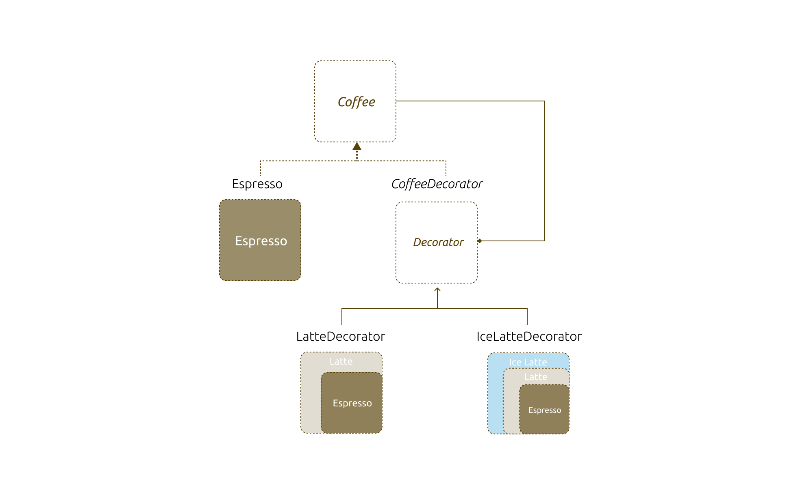

# patterns-for-state-management-in-react

Managing state in UI applications are challenging. Part of the reason is that there are many states to manage, local states like `isOpen` or `selectedIndex`, states indicators like `loading`, `error` for a async call is a bit tricker, and the state that represent a copy of the remote state is the hardest (because you will need to consider cache, retry, steal state, etc).

And developers have tried different ways to cope with the challenge since the very begining, library like `redux` and `mobx` tried to solve the problem and ended up introduce a few others, same things goes to the old context API (thus the introduce of the new version), and then `react-query`, `remix`, etc raised to simplify some of the hard issues.

Apart from the delicated libraries, there are also some patterns people turned to use for managing the states - the container presentation components, higer-order component, hooks, etc. are all have a role to play in the solution and problem domain.

In this article, I would like to discuss a bit more on the fundamental problems and different patterns, some were pretty useful and still valid today, while others might be a bit akward and I would suggest you to avoid in your future projects. And I also would like to purpose a pattern that I found pretty useful - especailly for the large and complicated UI applications.

Let's step back a little bit and start with a simple concept: higher-order function to start our journey.

## Higher order function

Higher-order funciton is a concept from functioanl programming, it means a function that takes or returns another function, or both. It might be a little bit confusing at the begining, especially if you started from a traditional object-oriented language that doesn't support it.

But in many cases it's a useful tool. For example, let's 

Say we have a function that print out an item's name and it's price:

```ts
const printLineItem = (item) => {
  return `Name: ${item.name} - Price: $${item.price}`;
};
```

and we also want to print 

```ts
const items = [
  { name: 'Apple', price: 1 },
  { name: 'Banana', price: 0.75 },
];

console.log(printLineItem(items[0]));

// Name: Apple - Price: $1
```

And we would like to add a few more details as a header of the report, we can create a function called `withHeader`. It takes a function as input, and returns another function.

```ts
const withHeader = (contentFunc) => {
  return (...args) => {
    const header = "=== Header ===\n";
    return header + contentFunc(...args);
  };
};
```

Then we could call `withHeader` with `printLineItem`:

```ts
const report = withHeader(printLineItem);
report(items[0]);
```

```ts
const printLineItem = (item) => {
  return `Name: ${item.name} - Price: $${item.price}`;
};

const withHeader = (contentFunc) => {
  return (...args) => {
    const header = "=== Header ===\n";
    return header + contentFunc(...args);
  };
};

const items = [
  { name: 'Apple', price: 1 },
  { name: 'Banana', price: 0.75 },
];

const withFooter = (contentFunc) => {
  return (...args) => {
    const footer = "\n=== Footer ===";
    return contentFunc(...args) + footer;
  };
};

const printAllItems = (items) => items.map(printLineItem).join('\n');

const report = withFooter(withHeader(printAllItems));

console.log(report(items));
```

And the output would be enhanced with a header:

```ts
=== Header ===
Name: Apple - Price: $1
```

Similiarly we could define another function `withFooter`, and wrap the resulting report to a new function:

```ts
const withFooter = (contentFunc) => {
  return (...args) => {
    const footer = "\n=== Footer ===";
    return contentFunc(...args) + footer;
  };
};

const report = withFooter(withHeader(printLineItem));
console.log(report(items[0]));
```

And the above would generate result like so:

```ts
=== Header ===
Name: Apple - Price: $1
=== Footer ===
```

which means we're enhancing the `printLineItem` without modify it, that is a great way to compose different functionailties. And also the beatuful thing here is the `withHeader`, `withFooter` has zero knowledge of what is wrapped as well - meaning we could define a `report` function that can deal with multiple items without modify `withHeader` or `withFooger`

```ts
const printAllItems = (items) => items.map(printLineItem).join('\n');

const report = withFooter(withHeader(printAllItems));
report(items);
```

In other words, everything are loosely coupled and thus can be composed freely. And then we started to wondering, can we do this in our React application too?

And the anwser is yes. Just like the higher order function we defined here, we can define a higher-order component: a component accepts another as input and returns a enhanced version - thanks for React as all these component are simply functions.

## Higher-order components

The idea of Higer-order components is simple, and it's useful when you need to inject some enhancement to a original component. For example, 

```tsx
const checkAuthorization = () => {
    //checking local storage or send request to remote 
}

const withAuthorization = (Component: React.FC): React.FC => {
  return (props: any) => {
    const isAuthorized = checkAuthorization();
    return isAuthorized ? <Component {...props} /> : <Login />;
  };
};
```

And for some page we don't want to expose to anyone directly, say a `Profile` page, we can wrap the component with `withAuthorization`:

```tsx
const Profile = withAuthorization(ProfileComponent);
```

<!-- 
If you have experiences on `redux`, the above code snippet should recall some of your memory like 

```tsx
export default connect(mapStateToProps)(TheActualComponent);
```

Essentially, connect is a higher-order function that returns a higher-order component. The higher-order component wraps around `TheActualComponent``, passing down additional props derived from the Redux store state via `mapStateToProps`. This syntax is a form of function composition, allowing `TheActualComponent` to access and interact with the Redux store while keeping the component itself decoupled from Redux. -->


Let's start with a simple ExpandablePanel component. The panel has a title and a content, normally the content is collpased, and it expands after a click. The implementation is straightforword:

```tsx
export type PanelProps = {
  heading: string;
  content: ReactNode;
};

const ExpandablePanel = ({ heading, content }: PanelProps) => {
  const [isOpen, setIsOpen] = useState<boolean>(false);

  return (
    <section>
      <header onClick={() => setIsOpen((isOpen) => !isOpen)}>{heading}</header>
      {isOpen && <main>{content}</main>}
    </section>
  );
};
```

Now let's think about a feature that we want the panel to expand by default and will auto close in a few seconds. We could modify the existing code pretty easily:

```tsx
const AutoCloseExpandablePanel = ({ heading, content }: PanelProps) => {
  const [isOpen, setIsOpen] = useState<boolean>(true);

  useEffect(() => {
    const id = setTimeout(() => {
      setIsOpen(false);
    }, 3000);

    return () => {
      clearTimeout(id);
    };
  });

  return (
    <section>
      <header onClick={() => setIsOpen((isOpen) => !isOpen)}>{heading}</header>
      {isOpen && <main>{content}</main>}
    </section>
  );
};
```

*Explain the code a bit*

This is pretty common ui pattern, for example we might need close an notification automatically, an alert, a tooltip, etc. So we can try to move this logic into a common place that other component can reuse.

```tsx
const withAutoClose =
  <T extends Partial<Toggleable>>(
    Component: React.FC<T>,
    duration: number = 2000
  ) =>
  (props: T) => {
    const [show, setShow] = useState<boolean>(true);

    useEffect(() => {
      if (show) {
        const timerId = setTimeout(() => setShow(false), duration);
        return () => clearTimeout(timerId);
      }
    }, [show]);

    return (
      <Component
        {...props}
        isOpen={show}
        toggle={() => setShow((show) => !show)}
      />
    );
  };

```

*explain a bit*, note the type definition here and the default value of the show.

```tsx
export interface Toggleable {
  isOpen: boolean;
  toggle: () => void;
}

export type PanelProps = {
  heading: string;
  content: ReactNode;
}  & Partial<Toggleable>;
```

Correspondingly, we will change ExpandablePanel to a stateless component, all the state control will be passed from the higher-order component `withAutoClose`:

```tsx
const ExpandablePanel = ({
  isOpen,
  toggle,
  heading,
  content,
}: PanelProps) => {
  return (
    <section>
      <header onClick={toggle}>{heading}</header>
      {isOpen && <main>{content}</main>}
    </section>
  );
};
```

And the AutoCloseExpandablePanel can be defined as:

```tsx
export default withAutoClose(ExpandablePanel, 3000);
```

And we then can re-use such logic in many places like:

```tsx
const AutoDismissToast = withAutoClose(Toast, 3000);
const TimedTooltip = withAutoClose(Tooltip, 3000);
```

The beautiful part of Higher-Order component is that it can be composed - you can use a hoc with the result of another hoc. Say, we have another hook `withKeyboardToggle` that allows you to use keyboard to expand or collpase a panel

```tsx
const noop = () => {};

const withKeyboardToggle =
  <T extends Partial<Toggleable>>(Component: React.FC<T>) =>
  (props: T) => {
    const divRef = useRef<HTMLDivElement>(null);

    const handleKeyDown = (event: KeyboardEvent<HTMLDivElement>) => {
      if (event.key === "Enter" || event.key === " ") {
        event.preventDefault();
        (props.toggle ?? noop)();
      }

      if (event.key === "Escape" && divRef.current) {
        divRef.current.blur();
      }
    };

    return (
      <div onKeyDown={handleKeyDown} tabIndex={0} ref={divRef}>
        <Component {...props} />
      </div>
    );
  };

export default withKeyboardToggle;
```

And then you can compose the two like so:

```tsx
const AccessibleAutoClosePanel = withAutoClose(withKeyboardToggle(ExpandablePanel), 2000);
```

*Some Examples are needed here*


And if you have some object-oriented programming experience, this should renosate you about the decorator design pattern. I assume you don't and I'll give you a simple example as a refresh, this pattern is important and we probabaly will see it again.

## Decorator patterns

Essentaily, decorator means ...

For example, espresso itself is a coffee, or we can see it implement the `Coffee` interface in OO's term. And We could make a `MilkeCoffee` interface implement the `Coffee` while adding some alteration to it - without breaking the interface contract. And the under the `MilkCoffee` there are many variations, Soy Latte, Almod Flat White, etc.




## Hooks

> ...With Hooks, you can extract stateful logic from a component so it can be tested independently and reused. Hooks allow you to reuse stateful logic without changing your component hierarchy...

```tsx
const useAutoClose = (duration: number) => {
  const [isOpen, setIsOpen] = useState<boolean>(true);

  useEffect(() => {
    if (isOpen) {
      const timerId = setTimeout(() => setIsOpen(false), duration);
      return () => clearTimeout(timerId);
    }
  }, [duration, isOpen]);

  const toggle = () => setIsOpen((show) => !show);

  return { isOpen, toggle };
};

export default useAutoClose;
```

To use the hook, we don't have to make too many changes to the original `ExpandablePanel`, we can embed the code in:

```tsx

const ExpandablePanel = ({ heading, content }: PanelProps) => {
  const { isOpen, toggle } = useAutoClose(2000);

  return (
    <section>
      <header onClick={toggle}>{heading}</header>
      {isOpen && <main>{content}</main>}
    </section>
  );
};
```

Note how little change we have to do here, and for the keyboard navigation, we could achieve it by do the following changes:

```tsx
const useKeyboard = (toggle: () => void) => {
  const handleKeyDown = (event: KeyboardEvent) => {
    if (event.key === "Enter" || event.key === " ") {
      event.preventDefault();
      toggle();
    }
  };

  return { handleKeyDown };
};
```

And use it like the following:

```tsx
const ExpandablePanel = ({ heading, content }: PanelProps) => {
  const { isOpen, toggle } = useAutoClose(2000);
  const { handleKeyDown } = useKeyboard(toggle);

  return (
    <section onKeyDown={handleKeyDown} tabIndex={0}>
      <header onClick={toggle}>{heading}</header>
      {isOpen && <main>{content}</main>}
    </section>
  );
};
```

*explain the code a bit"


*Describe a bit more on the benefits of hooks*

## Implement a dropdown list

Dropdown list is a common component we use in many places. Althrough there is a native select component that can fit in many basic usages, a advanced version with more control for each option has better user experience.


But to implement one - I mean a completely implementation require a lot of efforts than it looks on the surface. Enable keyboard navigation, consider accessibility (screen readers for instance), usability in mobile devices, etc.

We can start with a simple, desktop version that only supprt mouse clicks, and gradually build in more features to make it realistic. Note here the purpose is to reveal a few software design patterns other than teach how to build a dropdown list and use it in production - actually I don’t recommend you to do it and instead select some more mature libraries.

Essentially we need a element (let’s call it a trigger) for user to click, and a state to control weather show and hide of a list panel. Initially we hide the panel, and when trigger is clicked, we show the list panel.

```jsx
import { useState } from "react";

interface Item {
  icon: string;
  text: string;
  description: string;
}

type DropdownProps = {
  items: Item[];
};

const Dropdown = ({ items }: DropdownProps) => {
  const [isOpen, setIsOpen] = useState(false);
  const [selectedItem, setSelectedItem] = useState<Item | null>(null);

  return (
    <div className="dropdown">
      <div className="trigger" tabIndex={0} onClick={() => setIsOpen(!isOpen)}>
        <span className="selection">
          {selectedItem ? selectedItem.text : "Select an item..."}
        </span>
      </div>
      {isOpen && (
        <div className="dropdown-menu">
          {items.map((item, index) => (
            <div
              key={index}
              onClick={() => setSelectedItem(item)}
              className="item-container"
            >
              
              <div className="details">
                <div>{item.text}</div>
                <small>{item.description}</small>
              </div>
            </div>
          ))}
        </div>
      )}
    </div>
  );
};
```

*explain a bit about the code above.*

The code works fine, with a bit styling it pretty much act like a dropdown component. We could try to break it down to see it more clearly.

We can extract a `Tigger` component for allowing use to click:

```tsx
const Trigger = ({
  label,
  onClick,
}: {
  label: string;
  onClick: () => void;
}) => {
  return (
    <div className="trigger" tabIndex={0} onClick={onClick}>
      <span className="selection">{label}</span>
    </div>
  );
};
```

And for the list of items, we can extract a `DropdownMenu` component:

```tsx
const DropdownMenu = ({
  items,
  onItemClick,
}: {
  items: Item[];
  onItemClick: (item: Item) => void;
}) => {
  return (
    <div className="dropdown-menu">
      {items.map((item, index) => (
        <div
          key={index}
          onClick={() => onItemClick(item)}
          className="item-container"
        >
          
          <div className="details">
            <div>{item.text}</div>
            <small>{item.description}</small>
          </div>
        </div>
      ))}
    </div>
  );
};
```

And finally in `Dropdown`, we simply use these two components, and pass in the corresponding state, this will make them purely a controlled component (stateless component).

```tsx
const Dropdown = ({ items }: DropdownProps) => {
  const [isOpen, setIsOpen] = useState(false);
  const [selectedItem, setSelectedItem] = useState<Item | null>(null);

  return (
    <div className="dropdown">
      <Trigger
        label={selectedItem ? selectedItem.text : "Select an item..."}
        onClick={() => setIsOpen(!isOpen)}
      />
      {isOpen && <DropdownMenu items={items} onItemClick={setSelectedItem} />}
    </div>
  );
};
```

*explain a bit about the code above.*


## Implementing keyboard navigation

We need to listen to `onKeyDown` 

```tsx
const Dropdown = ({ items }: DropdownProps) => {
  const [isOpen, setIsOpen] = useState(false);
  const [selectedItem, setSelectedItem] = useState<Item | null>(null);

  const [selectedIndex, setSelectedIndex] = useState(0);

  const handleKeyDown = (e: React.KeyboardEvent) => {
    switch (e.key) {
      case "Enter":
      case " ":
        e.preventDefault();
        if (isOpen) {
          setSelectedItem(items[selectedIndex]);
          setIsOpen(false);
        } else {
          setIsOpen(true);
        }
        break;
      case "ArrowDown":
        e.preventDefault();
        setSelectedIndex((prevIndex) => {
          if (prevIndex === items.length - 1) {
            return 0;
          } else {
            return prevIndex + 1;
          }
        });
        break;
      case "ArrowUp":
        e.preventDefault();
        setSelectedIndex((prevIndex) => {
          if (prevIndex === 0) {
            return items.length - 1;
          } else {
            return prevIndex - 1;
          }
        });
        break;
      default:
        break;
    }
  };

  return (
    <div className="dropdown" onKeyDown={handleKeyDown}>
      <Trigger
        label={selectedItem ? selectedItem.text : "Select an item..."}
        onClick={() => setIsOpen(!isOpen)}
      />
      {isOpen && (
        <DropdownMenu
          items={items}
          onItemClick={setSelectedItem}
          selectedIndex={selectedIndex}
        />
      )}
    </div>
  );
};
```

Great, we have attached a `onKeyDown` event handler and it can detect the keypress when the element is focused (we have a `tabIndex` on the trigger element). Please note here we also passed `selectedIndex` to `DropdownMenu` item so when an item is selected we can decide to highlight it and set the aria attribute respectively:

```jsx
const DropdownMenu = ({
  items,
  selectedIndex,
  onItemClick,
}: {
  items: Item[];
  selectedIndex: number;
  onItemClick: (item: Item) => void;
}) => {
  return (
    <div className="dropdown-menu" role="listbox">
      {items.map((item, index) => (
        <div
          key={index}
          role="option"
          onClick={() => onItemClick(item)}
          className={`item-container ${
            index === selectedIndex ? "highlighted" : ""
          }`}
          aria-selected={index === selectedIndex}
        >
          
          <div className="details">
            <div>{item.text}</div>
            <small>{item.description}</small>
          </div>
        </div>
      ))}
    </div>
  );
};
```

*explain a bit about the code above.*

For all the states and keyboard event handlers, they can be moved into a custom hook. We can call it `useDropdown` :

```jsx
const getNextIndexOf = (total: number) => (current: number) => {
  if (current === total - 1) {
    return 0;
  } else {
    return current + 1;
  }
};

const getPreviousIndexOf = (total: number) => (current: number) => {
  if (current === 0) {
    return total - 1;
  } else {
    return current - 1;
  }
};

const useDropdown = (items: Item[]) => {
  const [isOpen, setIsOpen] = useState(false);
  const [selectedItem, setSelectedItem] = useState<Item | null>(null);

  const [selectedIndex, setSelectedIndex] = useState(0);

  const getNextIndex = getNextIndexOf(items.length);
  const getPreviousIndex = getPreviousIndexOf(items.length);

  const handleKeyDown = (e: React.KeyboardEvent) => {
    switch (e.key) {
      case "Enter":
      case " ":
        e.preventDefault();
        setSelectedItem(items[selectedIndex]);
        setIsOpen((isOpen) => !isOpen);
        break;
      case "ArrowDown":
        e.preventDefault();
        setSelectedIndex(getNextIndex);
        break;
      case "ArrowUp":
        e.preventDefault();
        setSelectedIndex(getPreviousIndex);
        break;
      default:
        break;
    }
  };
  
  const toggleDropdown = () => setIsOpen((isOpen) => !isOpen);

  return {
    isOpen,
    toggleDropdown,
    handleKeyDown,
    selectedItem,
    setSelectedItem,
    selectedIndex,
  };
};
```

*explain a bit on the code above*

And the `Dropdown` component itself is simplified as the following.

```jsx
const Dropdown = ({ items }: DropdownProps) => {
  const {
    isOpen,
    selectedItem,
    selectedIndex,
    toggleDropdown,
    handleKeyDown,
    setSelectedItem,
  } = useDropdown(items);

  return (
    <div className="dropdown" onKeyDown={handleKeyDown}>
      <Trigger
        onClick={toggleDropdown}
        label={selectedItem ? selectedItem.text : "Select an item..."}
      />
      {isOpen && (
        <DropdownMenu
          items={items}
          onItemClick={setSelectedItem}
          selectedIndex={selectedIndex}
        />
      )}
    </div>
  );
};
```

*explain a bit on the code above*

We can visualise the code a bit better with the React Devtools:


And the benefit of extracting the whole logic into a hook - and allows it to maintain these states: which item is selected, what to highlight, should we show or hide the panel, etc. And it frees us from the logic (or state management) from the UI.

I’ll extend that point a bit here. Let’s say in other similiar scenario we need another Dropdown component which in UI is slightly different than this one. Maybe using a different CSS framework and make it more visual appealing.

## What if I don’t like the UI?

We would like to use a button as a trigger, and showing some other elements in the dropdown list (showing the avatar inside a rounded square, for example).

And obviously I don’t want to rewrite all the keyboard navigation and states management again for the new dropdown.


With a few HTML+CSS twist, we could easily get something like this:

```tsx
const DropdownTailwind = ({ items }: DropdownProps) => {
  const {
    isOpen,
    toggleDropdown,
    selectedIndex,
    selectedItem,
    updateSelectedItem,
    getAriaAttributes,
    dropdownRef,
  } = useDropdown<Item>(items);

  return (
    <div
      className="relative"
      onClick={toggleDropdown}
      ref={dropdownRef as RefObject<HTMLDivElement>}
      {...getAriaAttributes()}
    >
      <button className="btn p-2 border rounded min-w-[240px]" tabIndex={0}>
        {selectedItem ? selectedItem.text : "Select an item..."}
      </button>

      {isOpen && (
        <ul
          className="dropdown-menu bg-white shadow-sm rounded mt-2 absolute w-full min-w-[240px]"
          role="listbox"
        >
          {(items).map((item, index) => (
            <li
              key={index}
              role="option"
              aria-selected={index === selectedIndex}
              onClick={() => updateSelectedItem(item)}
              className={`p-2 border-b border-gray-200 flex items-center ${
                index === selectedIndex ? "bg-gray-100" : ""
              } hover:bg-blue-100`}
            >
              
              <div className="flex flex-col">
                <span className="text">{item.text}</span>
                <span className="text-sm text-gray-500">
                  {item.description}
                </span>
              </div>
            </li>
          ))}
        </ul>
      )}
    </div>
  );
};
```

*explain a bit the code*

## Exploring a few more states


## Instead of doing such change in-place

To load data from remote, there are many bioplate code need to write. We will need to define three new states: loading, error and the actual data we need.

```tsx
//...
  const [loading, setLoading] = useState<boolean>(false);
  const [data, setData] = useState<Item[] | null>(null);
  const [error, setError] = useState<Error | undefined>(undefined);

  useEffect(() => {
    const fetchData = async () => {
      setLoading(true);

      try {
        const response = await fetch("/api/users");

        if (!response.ok) {
          const error = await response.json(); // assume the response body has error info
          throw new Error(`Error: ${error.error || response.status}`);
        }

        const data = await response.json();
        setData(data);
      } catch (e) {
        setError(e as Error);
      } finally {
        setLoading(false);
      }
    };

    fetchData();
  }, []);

//...
```

*explain a bit code*

Can we simplify the code a bit with what we just saw above - with hooks and higher-order function? Definitely

## Network request related chanages

We could extract the `fetchUsers` into a separate function:

```tsx
const fetchUsers = async () => {
  const response = await fetch("/api/users");

  if (!response.ok) {
    const error = await response.json();
    throw new Error('Something went wrong');
  }

  return await response.json();
};
```

We could then pass in this `fetchUsers` as a input into a hook, and inside the hook we call the function to fetch remote data:

```tsx
const useService = <T>(fetch: () => Promise<T>) => {
  const [loading, setLoading] = useState<boolean>(false);
  const [data, setData] = useState<T | null>(null);
  const [error, setError] = useState<Error | undefined>(undefined);

  useEffect(() => {
    const fetchData = async () => {
      setLoading(true);

      try {
        const data = await fetch();
        setData(data);
      } catch(e) {
        setError(e as Error);
      } finally {
        setLoading(false);
      }
    };

    fetchData();
  }, [fetch]);

  return {
    loading,
    error,
    data,
  };
}
```

And this `useService` higher-order function hook can be shared in all types of data fetching in our application. 

```tsx
cosnt { loading, error, data } = userService(fetchProducts);
//or 
cosnt { loading, error, data } = userService(fetchTickets);
```

And in the `Dropdown`, our code almost remain the simplest form:

```tsx
const Dropdown = () => {
  const { data, loading, error } = useService(fetchUsers);

  const {
    toggleDropdown,
    dropdownRef,
    isOpen,
    selectedItem,
    selectedIndex,
    updateSelectedItem,
    getAriaAttributes,
  } = useDropdown<Item>(data || []);

  const renderContent = () => {
    if (loading) return <Loading />;
    if (error) return <Error />;
    if (data) {
      return (
        <DropdownMenu
          items={data}
          updateSelectedItem={updateSelectedItem}
          selectedIndex={selectedIndex}
        />
      );
    }
    return null;
  };

  return (
    <div
      className="dropdown"
      ref={dropdownRef as RefObject<HTMLDivElement>}
      {...getAriaAttributes()}
    >
      <Trigger
        onClick={toggleDropdown}
        text={selectedItem ? selectedItem.text : "Select an item..."}
      />
      {isOpen && renderContent()}
    </div>
  );
};
```

## Headless components

This powerful pattern completely seprate our JSX code and the logic behind them, it's easy to compose the declaritve UI with JSX, but the difficult part is heavliy live inside the state management, and the headless component handles all these for us. And that could lead us to a new direction to abstract.

There are many libraries already available out there, I just list a few here as a reference. Again, the example above should only be learning purpose and don't try it in your production environment. To make customisable component fully aira compatiable, you need to spend trenmodens work behind the sence - so try to use some production proven libraries instead.


## Summary