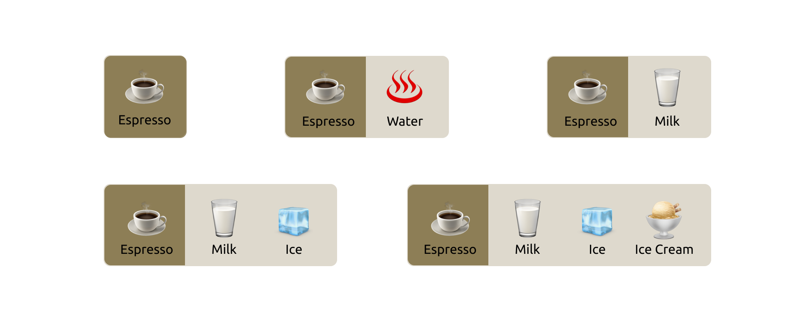

# patterns-for-state-management-in-react

Managing state in UI applications is a challenging endeavor. A part of this challenge stems from the many states one needs to manage. There are local states like `isOpen` or `selectedIndex`, states representing remote data like `loading`, `error`, `data`, and environmental states such as router paths, `isUserAuthorized`, and configurations like feature flags to determine the availability of certain features to the user.

Over time, developers have explored various strategies to tackle these challenges. Libraries like `redux` and `mobx` emerged as solutions, although they brought along their own set of problems. Similar issues befell the old context API, leading to the introduction of the new context API. Following that, libraries like `react-query`, `remix`, and others came up, each attempting to simplify certain complexities.

With specialized libraries targeting different aspects of state management, progress has been made. For instance, `react-query` significantly alleviates the challenges tied to asynchronous calls by providing features like caching, deduplication, retries, and error handling. Moreover, patterns like container/presentation components, higher-order components, and hooks have been adopted by developers to manage state. Each of these patterns has a role to play in both the problem and solution domains.

However, amidst these varying approaches, understanding the core problem and the rationale behind these solutions is crucial. It's relatively straightforward to follow a new pattern, but a deeper understanding of the 'why' behind these patterns will enable you to apply them more confidently in your specific use cases.

This article aims to delve into the fundamental problems and explore the various patterns that have evolved over time. Some of these patterns have stood the test of time and remain relevant, while others may have become somewhat awkward and are better avoided in future projects. Moreover, I'd like to propose a pattern that I've found to be particularly beneficial, especially for large and complex UI applications.

With that in mind, let's take a step back, maybe grab a coffee, and start with a basic yet powerful concept—higher-order functions (HOFs), setting the stage for our explorative journey into state management in React. 

## Higher order function

A higher-order function (HOF) is a concept borrowed from functional programming. It refers to a function that either accepts another function as an argument, returns a function, or both. This idea might initially seem perplexing, especially if you're coming from a traditional object-oriented programming background where this concept isn't as prevalent.

However, higher-order functions are incredibly useful tools in many scenarios. To illustrate, let’s consider a function, `printLineItem`, which outputs an item's name alongside its price:

```ts
const printLineItem = (item) => {
  return `Name: ${item.name} - Price: $${item.price}`;
};
```

Suppose you have an array of items:

```ts
const items = [
  { name: 'Apple', price: 1 },
  { name: 'Banana', price: 0.75 },
];

console.log(printLineItem(items[0]));

// Output: Name: Apple - Price: $1
```

Now, let's say you want to add a header to this output, to better structure the information. You could achieve this by creating a higher-order function named `withHeader`. This function accepts another function (`contentFunc`) as an argument and returns a new function:

```ts
const withHeader = (contentFunc) => {
  return (...args) => {
    const header = "=== Header ===\n";
    return header + contentFunc(...args);
  };
};
```

Now you can pass `printLineItem` to `withHeader`, which in turn, returns a new function. This new function, when called, will output the item information prefixed with a header:

```ts
const report = withHeader(printLineItem);
console.log(report(items[0]));

// Output:
// === Header ===
// Name: Apple - Price: $1
```

In this example, `withHeader` is a higher-order function that wraps around `printLineItem` to enhance its functionality, demonstrating a simple yet effective way to compose functions and extend their behavior.

Expanding on our initial example, let's introduce a bit more complexity to showcase the power and flexibility of higher-order functions.

```ts
const printLineItem = (item) => {
  return `Name: ${item.name} - Price: $${item.price}`;
};

const withHeader = (contentFunc) => {
  return (...args) => {
    const header = "=== Header ===\n";
    return header + contentFunc(...args);
  };
};

const items = [
  { name: 'Apple', price: 1 },
  { name: 'Banana', price: 0.75 },
];
```

Now, just as we created a `withHeader` function to add a header, let's create a `withFooter` function to append a footer to our output:

```ts
const withFooter = (contentFunc) => {
  return (...args) => {
    const footer = "\n=== Footer ===";
    return contentFunc(...args) + footer;
  };
};
```

We can now wrap `printLineItem` with both `withHeader` and `withFooter` to generate a detailed report for a single item:

```ts
const report = withFooter(withHeader(printLineItem));
console.log(report(items[0]));

// Output:
// === Header ===
// Name: Apple - Price: $1
// === Footer ===
```

This composition enhances `printLineItem` without modifying its original implementation, showcasing the beauty of function composition. Furthermore, `withHeader` and `withFooter` remain agnostic to the nature of the wrapped function, a powerful feature of higher-order functions.

Suppose now we want to generate a report for all items in the array. We can create a new function, `printAllItems`, to achieve this:

```ts
const printAllItems = (items) => items.map(printLineItem).join('\n');

const report = withFooter(withHeader(printAllItems));
console.log(report(items));

// Output:
// === Header ===
// Name: Apple - Price: $1
// Name: Banana - Price: $0.75
// === Footer ===
```

By doing so, we've now created a report for multiple items without altering the implementations of `withHeader` or `withFooter`. This example exemplifies the loose coupling and composability inherent in higher-order functions. 

As we reflect on this, an intriguing question arises: Can we transfer this level of composability and functional elegance into our React applications? 

Indeed, the ability to enhance components is not exclusive to functions; we can achieve the same with React components, thanks to Higher-Order Components (HOCs). A Higher-Order Component is a function that takes a component as an argument and returns a new, enhanced component.

## Higher-order Components

The principle behind Higher-order Components (HOCs) is straightforward: they allow you to inject additional functionality into an existing component. This pattern is especially beneficial when you want to reuse certain behaviors across multiple components.

Let's delve into an example:

```tsx
const checkAuthorization = () => {
    // Perform authorization check, e.g., check local storage or send a request to a remote server
}

const withAuthorization = (Component: React.FC): React.FC => {
  return (props: any) => {
    const isAuthorized = checkAuthorization();
    return isAuthorized ? <Component {...props} /> : <Login />;
  };
};
```

In this snippet, we define a function `checkAuthorization` to handle the authorization check. Next, we create a Higher-Order Component `withAuthorization`. This HOC takes a component (`Component`) as its argument and returns a new function. This returned function, when rendered, will either render the original `Component` (if the user is authorized) or a `Login` component (if the user is not authorized).

Now, suppose we have a `ProfileComponent` that we want to secure. We can use `withAuthorization` to create a new, secured version of `ProfileComponent`:

```tsx
const Profile = withAuthorization(ProfileComponent);
```

Now, whenever `Profile` is rendered, it will first check if the user is authorized. If so, it renders `ProfileComponent`; otherwise, it redirects the user to the `Login` component.

Now that we've seen how higher-order components can control access with `withAuthorization`, let's shift our focus to enhancing user interactions. We'll delve into an `ExpandablePanel` component, showcasing how higher-order components can also manage interactive UI elements and state transitions.

## ExpandablePanel component

Let's kick things off with a basic ExpandablePanel component. This component, as the name suggests, consists of a title and a content area. Initially, the content area is collapsed, but with a click on the title, it expands to reveal the content.


The code for such a component is straightforward:

```tsx
export type PanelProps = {
  heading: string;
  content: ReactNode;
};

const ExpandablePanel = ({ heading, content }: PanelProps) => {
  const [isOpen, setIsOpen] = useState<boolean>(false);

  return (
    <section>
      <header onClick={() => setIsOpen((isOpen) => !isOpen)}>{heading}</header>
      {isOpen && <main>{content}</main>}
    </section>
  );
};
```

Now, suppose we want to jazz it up a bit: make the panel expand automatically when rendered, and then collapse after a few seconds. Here's how we could adjust the code to achieve that:

```tsx
const AutoCloseExpandablePanel = ({ heading, content }: PanelProps) => {
  const [isOpen, setIsOpen] = useState<boolean>(true);

  useEffect(() => {
    const id = setTimeout(() => {
      setIsOpen(false);
    }, 3000);

    return () => {
      clearTimeout(id);
    };
  });

  return (
    <section>
      <header onClick={() => setIsOpen((isOpen) => !isOpen)}>{heading}</header>
      {isOpen && <main>{content}</main>}
    </section>
  );
};
```

In this revised version, we initialize `isOpen` to `true` so the panel starts expanded. Then we utilize `useEffect` to set a timer that collapses the panel after 3000 milliseconds (3 seconds).

This pattern of auto-collapsing components is quite common in UI development - think of notifications, alerts, or tooltips that disappear after a while. To promote code reusability, let's extract this auto-collapsing logic into a Higher-Order Component:

```tsx
interface Toggleable {
  isOpen: boolean;
  toggle: () => void;
}

const withAutoClose = <T extends Partial<Toggleable>>(
  Component: React.FC<T>,
  duration: number = 2000
) => (props: T) => {
  const [show, setShow] = useState<boolean>(true);

  useEffect(() => {
    if (show) {
      const timerId = setTimeout(() => setShow(false), duration);
      return () => clearTimeout(timerId);
    }
  }, [show]);

  return (
    <Component
      {...props}
      isOpen={show}
      toggle={() => setShow((show) => !show)}
    />
  );
};
```

In `withAutoClose`, we define a generic HOC that adds auto-closing functionality to any component. This HOC accepts a `duration` parameter to customize the auto-close delay, defaulting to 2000 milliseconds (2 seconds).

To ensure a smooth integration, we extend `PanelProps` to include optional `Toggleable` properties:

```tsx
type PanelProps = {
  heading: string;
  content: ReactNode;
}  & Partial<Toggleable>;
```

Now, we can refactor `ExpandablePanel` to accept `isOpen` and `toggle` props from `withAutoClose`:

```tsx
const ExpandablePanel = ({
  isOpen,
  toggle,
  heading,
  content,
}: PanelProps) => {
  return (
    <section>
      <header onClick={toggle}>{heading}</header>
      {isOpen && <main>{content}</main>}
    </section>
  );
};
```

With this setup, creating an auto-closing version of `ExpandablePanel` is a breeze:

```tsx
export default withAutoClose(ExpandablePanel, 3000);
```

And guess what? The auto-closing logic we've encapsulated in `withAutoClose` can be reused across various components:

```tsx
const AutoDismissToast = withAutoClose(Toast, 3000);
const TimedTooltip = withAutoClose(Tooltip, 3000);
```

The versatility of Higher-Order Components (HOCs) shines when it comes to composition - the ability to apply one HOC to the result of another. This capability aligns well with the principle of function composition in functional programming. Let's consider another HOC, `withKeyboardToggle`, which augments a panel's behavior to respond to keyboard inputs for toggling the panel's expanded/collapsed state.

Here's the code for `withKeyboardToggle`:

```tsx
const noop = () => {};

const withKeyboardToggle =
  <T extends Partial<Toggleable>>(Component: React.FC<T>) =>
  (props: T) => {
    const divRef = useRef<HTMLDivElement>(null);

    const handleKeyDown = (event: KeyboardEvent<HTMLDivElement>) => {
      if (event.key === "Enter" || event.key === " ") {
        event.preventDefault();
        (props.toggle ?? noop)();
      }

      if (event.key === "Escape" && divRef.current) {
        divRef.current.blur();
      }
    };

    return (
      <div onKeyDown={handleKeyDown} tabIndex={0} ref={divRef}>
        <Component {...props} />
      </div>
    );
  };

export default withKeyboardToggle;
```

In the `withKeyboardToggle` HOC, a reference (`divRef`) is created for the wrapping `div` to enable keyboard interactions. The `handleKeyDown` function defines the behavior for the Enter, Space, and Escape keys. The Enter or Space keys toggle the panel's state, while the Escape key removes focus from the panel.

Now, let's compose `withKeyboardToggle` and `withAutoClose` together to create a new component `AccessibleAutoClosePanel`:

```tsx
const AccessibleAutoClosePanel = withAutoClose(withKeyboardToggle(ExpandablePanel), 2000);
```

In the expression `withAutoClose(withKeyboardToggle(ExpandablePanel), 2000);`, `withKeyboardToggle` is first applied to `ExpandablePanel`, enhancing it with keyboard toggle capability. The result is then fed into `withAutoClose`, which further enhances the component to auto-close after a 2000 millisecond delay. This chaining of HOCs results in a new component, `AccessibleAutoClosePanel`, which inherits both the keyboard toggle and auto-close behaviors. This is a vivid example of how HOCs can be nested and composed to build more complex behavior from simpler, single-responsibility components.


And if you have some object-oriented programming experience, this should renosate you about the decorator design pattern. I assume you don't and I'll give you a simple example as a refresh, this pattern is important and we probabaly will see it again.

---

## Decorator patterns

Essentaily, decorator means ...

For example, espresso itself is a coffee, or we can see it implement the `Coffee` interface in OO's term. And We could make a `MilkeCoffee` interface implement the `Coffee` while adding some alteration to it - without breaking the interface contract. And the under the `MilkCoffee` there are many variations, Soy Latte, Almod Flat White, etc.



If we use class diagram to demonstrate the relationship of entities above, it would be something like the following. Note how the decorator and the wrapped class are all implementing the original `coffee` interface.


And each wrapper class can do exactly the same - and to the consumers it's still coffee.

---

Higher-Order Components (HOCs) are a powerful pattern for creating composable and reusable logic in your components. However, they come with their own set of advantages and drawbacks. Let's take a look:

### Pros of Higher-Order Components:
1. **Reusability:** HOCs enable you to extract and reuse common logic across multiple components, promoting DRY (Don't Repeat Yourself) principles.
2. **Composition:** They thrive in a system that favors composition, allowing developers to create enhanced components by composing multiple HOCs together.
3. **Separation of Concerns:** By isolating certain behaviors or logic into HOCs, they help in maintaining a clean separation of concerns.
4. **Abstraction:** They provide a level of abstraction that can help in organizing higher-level logic, aiding in the manageability of the code.

### Cons of Higher-Order Components:
1. **Prop Collision:** There's a risk of prop name collisions, where the HOC might override the props of the wrapped component or vice versa.
2. **Indirection:** They add layers of indirection to your component hierarchy, which might make debugging and maintenance more challenging.
3. **Complexity:** The composition of multiple HOCs can lead to a 'wrapper hell', where components are wrapped in multiple layers of HOCs, making the code harder to understand and follow.

Transitioning from Higher-Order Components, we now venture into Hooks — a newer and potent feature in React for handling state and effects in functional components. Up next, we'll unravel how Hooks provide a more straightforward approach to managing state and logic in your components.

## Hooks

> ...With Hooks, you can extract stateful logic from a component so it can be tested independently and reused. Hooks allow you to reuse stateful logic without changing your component hierarchy...

Hooks provide a means to extract stateful logic from a component, enabling its independent testing and reuse. They pave the way for reutilizing stateful logic without altering your component hierarchy. Essentially, Hooks let you "hook into" React state and other lifecycle features from function components.

```tsx
const useAutoClose = (duration: number) => {
  const [isOpen, setIsOpen] = useState<boolean>(true);

  useEffect(() => {
    if (isOpen) {
      const timerId = setTimeout(() => setIsOpen(false), duration);
      return () => clearTimeout(timerId);
    }
  }, [duration, isOpen]);

  const toggle = () => setIsOpen((show) => !show);

  return { isOpen, toggle };
};

export default useAutoClose;
```

In this `useAutoClose` hook, we create a state `isOpen` and a function `toggle` to switch the state. The `useEffect` function sets a timer to change `isOpen` to false after a specified duration, but only if `isOpen` is true. It also cleans up the timer to prevent memory leaks.

Now, to integrate this hook into our `ExpandablePanel`, minimal amendments are needed:

```tsx
const ExpandablePanel = ({ heading, content }: PanelProps) => {
  const { isOpen, toggle } = useAutoClose(2000);

  return (
    <section>
      <header onClick={toggle}>{heading}</header>
      {isOpen && <main>{content}</main>}
    </section>
  );
};
```
The `ExpandablePanel` now utilizes `useAutoClose`, seamlessly incorporating the auto-close functionality. Next, to incorporate keyboard navigation, we define another hook, `useKeyboard`, which captures key events to toggle the panel:

```tsx
const useKeyboard = (toggle: () => void) => {
  const handleKeyDown = (event: KeyboardEvent) => {
    if (event.key === "Enter" || event.key === " ") {
      event.preventDefault();
      toggle();
    }
  };

  return { handleKeyDown };
};
```

Embedding `useKeyboard` within `ExpandablePanel` is straightforward:

```tsx
const ExpandablePanel = ({ heading, content }: PanelProps) => {
  const { isOpen, toggle } = useAutoClose(2000);
  const { handleKeyDown } = useKeyboard(toggle);

  return (
    <section onKeyDown={handleKeyDown} tabIndex={0}>
      <header onClick={toggle}>{heading}</header>
      {isOpen && <main>{content}</main>}
    </section>
  );
};
```

Here, `handleKeyDown` from `useKeyboard` is employed to detect key presses, enhancing our component with keyboard interactivity.


Hooks embody a neat package of reusable logic, isolated from the component, yet easily integrated. Unlike the wrapping approach of HOCs, hooks offer a plug-in mechanism, making them lightweight and well-managed by React. This characteristic of hooks not only promotes code modularity but also facilitates a cleaner and more intuitive way to enrich our components with additional functionalities.

---

## Implement a dropdown list

Dropdown list is a common component we use in many places. Althrough there is a native select component that can fit in many basic usages, a advanced version with more control for each option has better user experience.


But to implement one - I mean a completely implementation require a lot of efforts than it looks on the surface. Enable keyboard navigation, consider accessibility (screen readers for instance), usability in mobile devices, etc.

We can start with a simple, desktop version that only supprt mouse clicks, and gradually build in more features to make it realistic. Note here the purpose is to reveal a few software design patterns other than teach how to build a dropdown list and use it in production - actually I don’t recommend you to do it and instead select some more mature libraries.

Essentially we need a element (let’s call it a trigger) for user to click, and a state to control weather show and hide of a list panel. Initially we hide the panel, and when trigger is clicked, we show the list panel.

```jsx
import { useState } from "react";

interface Item {
  icon: string;
  text: string;
  description: string;
}

type DropdownProps = {
  items: Item[];
};

const Dropdown = ({ items }: DropdownProps) => {
  const [isOpen, setIsOpen] = useState(false);
  const [selectedItem, setSelectedItem] = useState<Item | null>(null);

  return (
    <div className="dropdown">
      <div className="trigger" tabIndex={0} onClick={() => setIsOpen(!isOpen)}>
        <span className="selection">
          {selectedItem ? selectedItem.text : "Select an item..."}
        </span>
      </div>
      {isOpen && (
        <div className="dropdown-menu">
          {items.map((item, index) => (
            <div
              key={index}
              onClick={() => setSelectedItem(item)}
              className="item-container"
            >
              
              <div className="details">
                <div>{item.text}</div>
                <small>{item.description}</small>
              </div>
            </div>
          ))}
        </div>
      )}
    </div>
  );
};
```

*explain a bit about the code above.*

The code works fine, with a bit styling it pretty much act like a dropdown component. We could try to break it down to see it more clearly.

We can extract a `Tigger` component for allowing use to click:

```tsx
const Trigger = ({
  label,
  onClick,
}: {
  label: string;
  onClick: () => void;
}) => {
  return (
    <div className="trigger" tabIndex={0} onClick={onClick}>
      <span className="selection">{label}</span>
    </div>
  );
};
```

And for the list of items, we can extract a `DropdownMenu` component:

```tsx
const DropdownMenu = ({
  items,
  onItemClick,
}: {
  items: Item[];
  onItemClick: (item: Item) => void;
}) => {
  return (
    <div className="dropdown-menu">
      {items.map((item, index) => (
        <div
          key={index}
          onClick={() => onItemClick(item)}
          className="item-container"
        >
          
          <div className="details">
            <div>{item.text}</div>
            <small>{item.description}</small>
          </div>
        </div>
      ))}
    </div>
  );
};
```

And finally in `Dropdown`, we simply use these two components, and pass in the corresponding state, this will make them purely a controlled component (stateless component).

```tsx
const Dropdown = ({ items }: DropdownProps) => {
  const [isOpen, setIsOpen] = useState(false);
  const [selectedItem, setSelectedItem] = useState<Item | null>(null);

  return (
    <div className="dropdown">
      <Trigger
        label={selectedItem ? selectedItem.text : "Select an item..."}
        onClick={() => setIsOpen(!isOpen)}
      />
      {isOpen && <DropdownMenu items={items} onItemClick={setSelectedItem} />}
    </div>
  );
};
```

*explain a bit about the code above.*


## Implementing keyboard navigation

We need to listen to `onKeyDown` 

```tsx
const Dropdown = ({ items }: DropdownProps) => {
  const [isOpen, setIsOpen] = useState(false);
  const [selectedItem, setSelectedItem] = useState<Item | null>(null);

  const [selectedIndex, setSelectedIndex] = useState(0);

  const handleKeyDown = (e: React.KeyboardEvent) => {
    switch (e.key) {
      case "Enter":
      case " ":
        e.preventDefault();
        if (isOpen) {
          setSelectedItem(items[selectedIndex]);
          setIsOpen(false);
        } else {
          setIsOpen(true);
        }
        break;
      case "ArrowDown":
        e.preventDefault();
        setSelectedIndex((prevIndex) => {
          if (prevIndex === items.length - 1) {
            return 0;
          } else {
            return prevIndex + 1;
          }
        });
        break;
      case "ArrowUp":
        e.preventDefault();
        setSelectedIndex((prevIndex) => {
          if (prevIndex === 0) {
            return items.length - 1;
          } else {
            return prevIndex - 1;
          }
        });
        break;
      default:
        break;
    }
  };

  return (
    <div className="dropdown" onKeyDown={handleKeyDown}>
      <Trigger
        label={selectedItem ? selectedItem.text : "Select an item..."}
        onClick={() => setIsOpen(!isOpen)}
      />
      {isOpen && (
        <DropdownMenu
          items={items}
          onItemClick={setSelectedItem}
          selectedIndex={selectedIndex}
        />
      )}
    </div>
  );
};
```

Great, we have attached a `onKeyDown` event handler and it can detect the keypress when the element is focused (we have a `tabIndex` on the trigger element). Please note here we also passed `selectedIndex` to `DropdownMenu` item so when an item is selected we can decide to highlight it and set the aria attribute respectively:

```jsx
const DropdownMenu = ({
  items,
  selectedIndex,
  onItemClick,
}: {
  items: Item[];
  selectedIndex: number;
  onItemClick: (item: Item) => void;
}) => {
  return (
    <div className="dropdown-menu" role="listbox">
      {items.map((item, index) => (
        <div
          key={index}
          role="option"
          onClick={() => onItemClick(item)}
          className={`item-container ${
            index === selectedIndex ? "highlighted" : ""
          }`}
          aria-selected={index === selectedIndex}
        >
          
          <div className="details">
            <div>{item.text}</div>
            <small>{item.description}</small>
          </div>
        </div>
      ))}
    </div>
  );
};
```

*explain a bit about the code above.*

For all the states and keyboard event handlers, they can be moved into a custom hook. We can call it `useDropdown` :

```jsx
const getNextIndexOf = (total: number) => (current: number) => {
  if (current === total - 1) {
    return 0;
  } else {
    return current + 1;
  }
};

const getPreviousIndexOf = (total: number) => (current: number) => {
  if (current === 0) {
    return total - 1;
  } else {
    return current - 1;
  }
};

const useDropdown = (items: Item[]) => {
  const [isOpen, setIsOpen] = useState(false);
  const [selectedItem, setSelectedItem] = useState<Item | null>(null);

  const [selectedIndex, setSelectedIndex] = useState(0);

  const getNextIndex = getNextIndexOf(items.length);
  const getPreviousIndex = getPreviousIndexOf(items.length);

  const handleKeyDown = (e: React.KeyboardEvent) => {
    switch (e.key) {
      case "Enter":
      case " ":
        e.preventDefault();
        setSelectedItem(items[selectedIndex]);
        setIsOpen((isOpen) => !isOpen);
        break;
      case "ArrowDown":
        e.preventDefault();
        setSelectedIndex(getNextIndex);
        break;
      case "ArrowUp":
        e.preventDefault();
        setSelectedIndex(getPreviousIndex);
        break;
      default:
        break;
    }
  };
  
  const toggleDropdown = () => setIsOpen((isOpen) => !isOpen);

  return {
    isOpen,
    toggleDropdown,
    handleKeyDown,
    selectedItem,
    setSelectedItem,
    selectedIndex,
  };
};
```

*explain a bit on the code above*

And the `Dropdown` component itself is simplified as the following.

```jsx
const Dropdown = ({ items }: DropdownProps) => {
  const {
    isOpen,
    selectedItem,
    selectedIndex,
    toggleDropdown,
    handleKeyDown,
    setSelectedItem,
  } = useDropdown(items);

  return (
    <div className="dropdown" onKeyDown={handleKeyDown}>
      <Trigger
        onClick={toggleDropdown}
        label={selectedItem ? selectedItem.text : "Select an item..."}
      />
      {isOpen && (
        <DropdownMenu
          items={items}
          onItemClick={setSelectedItem}
          selectedIndex={selectedIndex}
        />
      )}
    </div>
  );
};
```

*explain a bit on the code above*

We can visualise the code a bit better with the React Devtools:


And the benefit of extracting the whole logic into a hook - and allows it to maintain these states: which item is selected, what to highlight, should we show or hide the panel, etc. And it frees us from the logic (or state management) from the UI.

I’ll extend that point a bit here. Let’s say in other similiar scenario we need another Dropdown component which in UI is slightly different than this one. Maybe using a different CSS framework and make it more visual appealing.

## What if I don’t like the UI?

We would like to use a button as a trigger, and showing some other elements in the dropdown list (showing the avatar inside a rounded square, for example).

And obviously I don’t want to rewrite all the keyboard navigation and states management again for the new dropdown.


With a few HTML+CSS twist, we could easily get something like this:

```tsx
const DropdownTailwind = ({ items }: DropdownProps) => {
  const {
    isOpen,
    toggleDropdown,
    selectedIndex,
    selectedItem,
    updateSelectedItem,
    getAriaAttributes,
    dropdownRef,
  } = useDropdown<Item>(items);

  return (
    <div
      className="relative"
      onClick={toggleDropdown}
      ref={dropdownRef as RefObject<HTMLDivElement>}
      {...getAriaAttributes()}
    >
      <button className="btn p-2 border rounded min-w-[240px]" tabIndex={0}>
        {selectedItem ? selectedItem.text : "Select an item..."}
      </button>

      {isOpen && (
        <ul
          className="dropdown-menu bg-white shadow-sm rounded mt-2 absolute w-full min-w-[240px]"
          role="listbox"
        >
          {(items).map((item, index) => (
            <li
              key={index}
              role="option"
              aria-selected={index === selectedIndex}
              onClick={() => updateSelectedItem(item)}
              className={`p-2 border-b border-gray-200 flex items-center ${
                index === selectedIndex ? "bg-gray-100" : ""
              } hover:bg-blue-100`}
            >
              
              <div className="flex flex-col">
                <span className="text">{item.text}</span>
                <span className="text-sm text-gray-500">
                  {item.description}
                </span>
              </div>
            </li>
          ))}
        </ul>
      )}
    </div>
  );
};
```

*explain a bit the code*

## Exploring a few more states


## Instead of doing such change in-place

To load data from remote, there are many bioplate code need to write. We will need to define three new states: loading, error and the actual data we need.

```tsx
//...
  const [loading, setLoading] = useState<boolean>(false);
  const [data, setData] = useState<Item[] | null>(null);
  const [error, setError] = useState<Error | undefined>(undefined);

  useEffect(() => {
    const fetchData = async () => {
      setLoading(true);

      try {
        const response = await fetch("/api/users");

        if (!response.ok) {
          const error = await response.json(); // assume the response body has error info
          throw new Error(`Error: ${error.error || response.status}`);
        }

        const data = await response.json();
        setData(data);
      } catch (e) {
        setError(e as Error);
      } finally {
        setLoading(false);
      }
    };

    fetchData();
  }, []);

//...
```

*explain a bit code*

Can we simplify the code a bit with what we just saw above - with hooks and higher-order function? Definitely

## Network request related chanages

We could extract the `fetchUsers` into a separate function:

```tsx
const fetchUsers = async () => {
  const response = await fetch("/api/users");

  if (!response.ok) {
    const error = await response.json();
    throw new Error('Something went wrong');
  }

  return await response.json();
};
```

We could then pass in this `fetchUsers` as a input into a hook, and inside the hook we call the function to fetch remote data:

```tsx
const useService = <T>(fetch: () => Promise<T>) => {
  const [loading, setLoading] = useState<boolean>(false);
  const [data, setData] = useState<T | null>(null);
  const [error, setError] = useState<Error | undefined>(undefined);

  useEffect(() => {
    const fetchData = async () => {
      setLoading(true);

      try {
        const data = await fetch();
        setData(data);
      } catch(e) {
        setError(e as Error);
      } finally {
        setLoading(false);
      }
    };

    fetchData();
  }, [fetch]);

  return {
    loading,
    error,
    data,
  };
}
```

And this `useService` higher-order function hook can be shared in all types of data fetching in our application. 

```tsx
cosnt { loading, error, data } = userService(fetchProducts);
//or 
cosnt { loading, error, data } = userService(fetchTickets);
```

And in the `Dropdown`, our code almost remain the simplest form:

```tsx
const Dropdown = () => {
  const { data, loading, error } = useService(fetchUsers);

  const {
    toggleDropdown,
    dropdownRef,
    isOpen,
    selectedItem,
    selectedIndex,
    updateSelectedItem,
    getAriaAttributes,
  } = useDropdown<Item>(data || []);

  const renderContent = () => {
    if (loading) return <Loading />;
    if (error) return <Error />;
    if (data) {
      return (
        <DropdownMenu
          items={data}
          updateSelectedItem={updateSelectedItem}
          selectedIndex={selectedIndex}
        />
      );
    }
    return null;
  };

  return (
    <div
      className="dropdown"
      ref={dropdownRef as RefObject<HTMLDivElement>}
      {...getAriaAttributes()}
    >
      <Trigger
        onClick={toggleDropdown}
        text={selectedItem ? selectedItem.text : "Select an item..."}
      />
      {isOpen && renderContent()}
    </div>
  );
};
```

## Headless components

This powerful pattern completely seprate our JSX code and the logic behind them, it's easy to compose the declaritve UI with JSX, but the difficult part is heavliy live inside the state management, and the headless component handles all these for us. And that could lead us to a new direction to abstract.

There are many libraries already available out there, I just list a few here as a reference. Again, the example above should only be learning purpose and don't try it in your production environment. To make customisable component fully aira compatiable, you need to spend trenmodens work behind the sence - so try to use some production proven libraries instead.


## Summary