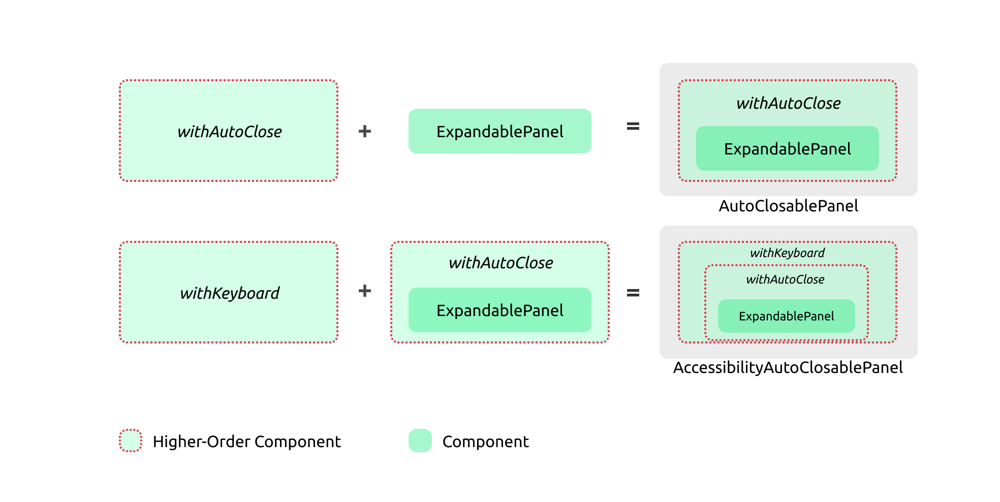

With that in mind, let's take a step back, maybe grab a coffee, and start with a basic yet powerful concept—higher-order functions (HOFs), setting the stage for our explorative journey into state management in React. 

## Starting with Higher-order Function

A higher-order function (HOF) is a concept borrowed from functional programming. It refers to a function that either accepts another function as an argument, returns a function, or both. This idea might initially seem perplexing, especially if you're coming from a traditional object-oriented programming background where this concept isn't as prevalent.

However, higher-order functions are incredibly useful tools in many scenarios. To illustrate, let’s consider a function, `printLineItem`, which outputs an item's name alongside its price:

```ts
const printLineItem = (item) => {
  return `Name: ${item.name} - Price: $${item.price}`;
};
```

Suppose you have an array of items, and we can call `printLineItem` to print out the formatted details:

```ts
const items = [
  { name: 'Apple', price: 1 },
  { name: 'Banana', price: 0.75 },
];

console.log(printLineItem(items[0]));
```

Now, let's say you want to add a header to this output, to better structure the information. You could achieve this by creating a higher-order function named `withHeader`. This function accepts another function (`contentFunc`) as an argument and returns a new function:

```ts
const withHeader = (contentFunc) => {
  return (...args) => {
    const header = "=== Header ===\n";
    return header + contentFunc(...args);
  };
};
```

Now you can pass `printLineItem` to `withHeader`, which in turn, returns a new function. This new function, when called, will output the item information prefixed with a header:

```ts
const report = withHeader(printLineItem);
console.log(report(items[0]));
```

It will output something like this:

```text
=== Header ===
Name: Apple - Price: $1
```

In this example, `withHeader` is a higher-order function that wraps around `printLineItem` to enhance its functionality, demonstrating a simple yet effective way to compose functions and extend their behavior.

Now, just as we created a `withHeader` function to add a header, let's create a `withFooter` function to append a footer to our output:

```ts
const withFooter = (contentFunc) => {
  return (...args) => {
    const footer = "\n=== Footer ===";
    return contentFunc(...args) + footer;
  };
};
```

We can now wrap `printLineItem` with both `withHeader` and `withFooter` to generate a detailed report for a single item:

```ts
const report = withFooter(withHeader(printLineItem));
console.log(report(items[0]));
```

The above code would print out something more informative:

```text
=== Header ===
Name: Apple - Price: $1
=== Footer ===
```

This composition enhances `printLineItem` without modifying its original implementation, showcasing the beauty of function composition. Furthermore, `withHeader` and `withFooter` remain agnostic to the nature of the wrapped function, a powerful feature of higher-order functions.

Suppose now we want to generate a report for all items in the array. We can create a new function, `printAllItems`, to achieve this:

```ts
const printAllItems = (items) => items.map(printLineItem).join('\n');

const report = withFooter(withHeader(printAllItems));
console.log(report(items));
```

By doing so, we've now created a report for multiple items without altering the implementations of `withHeader` or `withFooter`. This example exemplifies the loose coupling and composability inherent in higher-order functions. 

Observe that the higher-order functions withHeader and withFooter accept a function as input. The function they return maintains the same signature as the input function and can be utilized in the same manner as invoking the original function. This exemplifies a potent pattern that can be harnessed in various scenarios.

As we reflect on this, an intriguing question arises: Can we transfer this level of composability and functional elegance into our React applications? 

Indeed, the ability to enhance components is not exclusive to functions; we can achieve the same with React components, thanks to Higher-Order Components (HOCs). A Higher-Order Component is a function that takes a component as an argument and returns a new, enhanced component.

## Introducing Higher-order Components

The principle behind Higher-order Components (HOCs) is straightforward: they allow you to inject additional functionality into an existing component. This pattern is especially beneficial when you want to reuse certain behaviors across multiple components.

Let's delve into an example:

```tsx
const checkAuthorization = () => {
    // Perform authorization check, e.g., check local storage or send a request to a remote server
}

const withAuthorization = (Component: React.FC): React.FC => {
  return (props: any) => {
    const isAuthorized = checkAuthorization();
    return isAuthorized ? <Component {...props} /> : <Login />;
  };
};
```

In this snippet, we define a function `checkAuthorization` to handle the authorization check. Next, we create a Higher-Order Component `withAuthorization`. This HOC takes a component (`Component`) as its argument and returns a new function. This returned function, when rendered, will either render the original `Component` (if the user is authorized) or a `Login` component (if the user is not authorized).

Now, suppose we have a `ProfileComponent` that we want to secure. We can use `withAuthorization` to create a new, secured version of `ProfileComponent`:

```tsx
const Profile = withAuthorization(ProfileComponent);
```

Now, whenever `Profile` is rendered, it will first check if the user is authorized. If so, it renders `ProfileComponent`; otherwise, it redirects the user to the `Login` component.

Now that we've seen how higher-order components can control access with `withAuthorization`, let's shift our focus to enhancing user interactions. We'll delve into an `ExpandablePanel` component, showcasing how higher-order components can also manage interactive UI elements and state transitions.

### Implementing an ExpandablePanel Component

Let's kick things off with a basic ExpandablePanel component. This component, as the name suggests, consists of a title and a content area. Initially, the content area is collapsed, but with a click on the title, it expands to reveal the content.


The code for such a component is straightforward:

```tsx
export type PanelProps = {
  heading: string;
  content: ReactNode;
};

const ExpandablePanel = ({ heading, content }: PanelProps) => {
  const [isOpen, setIsOpen] = useState<boolean>(false);

  return (
    <section>
      <header onClick={() => setIsOpen((isOpen) => !isOpen)}>{heading}</header>
      {isOpen && <main>{content}</main>}
    </section>
  );
};
```

Now, suppose we want to jazz it up a bit: make the panel expand automatically when rendered, and then collapse after a few seconds. Here's how we could adjust the code to achieve that:

```tsx
const AutoCloseExpandablePanel = ({ heading, content }: PanelProps) => {
  const [isOpen, setIsOpen] = useState<boolean>(true);

  useEffect(() => {
    const id = setTimeout(() => {
      setIsOpen(false);
    }, 3000);

    return () => {
      clearTimeout(id);
    };
  });

  return (
    <section>
      <header onClick={() => setIsOpen((isOpen) => !isOpen)}>{heading}</header>
      {isOpen && <main>{content}</main>}
    </section>
  );
};
```

In this revised version, we initialize `isOpen` to `true` so the panel starts expanded. Then we utilize `useEffect` to set a timer that collapses the panel after 3000 milliseconds (3 seconds).

This pattern of auto-collapsing components is quite common in UI development - think of notifications, alerts, or tooltips that disappear after a while. To promote code reusability, let's extract this auto-collapsing logic into a Higher-Order Component:

```tsx
interface Toggleable {
  isOpen: boolean;
  toggle: () => void;
}

const withAutoClose = <T extends Partial<Toggleable>>(
  Component: React.FC<T>,
  duration: number = 2000
) => (props: T) => {
  const [show, setShow] = useState<boolean>(true);

  useEffect(() => {
    if (show) {
      const timerId = setTimeout(() => setShow(false), duration);
      return () => clearTimeout(timerId);
    }
  }, [show]);

  return (
    <Component
      {...props}
      isOpen={show}
      toggle={() => setShow((show) => !show)}
    />
  );
};
```

In `withAutoClose`, we define a generic HOC that adds auto-closing functionality to any component. This HOC accepts a `duration` parameter to customize the auto-close delay, defaulting to 2000 milliseconds (2 seconds).

To ensure a smooth integration, we extend `PanelProps` to include optional `Toggleable` properties:

```tsx
type PanelProps = {
  heading: string;
  content: ReactNode;
}  & Partial<Toggleable>;
```

Now, we can refactor `ExpandablePanel` to accept `isOpen` and `toggle` props from `withAutoClose`:

```tsx
const ExpandablePanel = ({
  isOpen,
  toggle,
  heading,
  content,
}: PanelProps) => {
  return (
    <section>
      <header onClick={toggle}>{heading}</header>
      {isOpen && <main>{content}</main>}
    </section>
  );
};
```

With this setup, creating an auto-closing version of `ExpandablePanel` is a breeze:

```tsx
export default withAutoClose(ExpandablePanel, 3000);
```

And guess what? The auto-closing logic we've encapsulated in `withAutoClose` can be reused across various components:

```tsx
const AutoDismissToast = withAutoClose(Toast, 3000);
const TimedTooltip = withAutoClose(Tooltip, 3000);
```

The versatility of Higher-Order Components (HOCs) shines when it comes to composition - the ability to apply one HOC to the result of another. This capability aligns well with the principle of function composition in functional programming. Let's consider another HOC, `withKeyboardToggle`, which augments a panel's behavior to respond to keyboard inputs for toggling the panel's expanded/collapsed state.

Here's the code for `withKeyboardToggle`:

```tsx
const noop = () => {};

const withKeyboardToggle =
  <T extends Partial<Toggleable>>(Component: React.FC<T>) =>
  (props: T) => {
    const divRef = useRef<HTMLDivElement>(null);

    const handleKeyDown = (event: KeyboardEvent<HTMLDivElement>) => {
      if (event.key === "Enter" || event.key === " ") {
        event.preventDefault();
        (props.toggle ?? noop)();
      }

      if (event.key === "Escape" && divRef.current) {
        divRef.current.blur();
      }
    };

    return (
      <div onKeyDown={handleKeyDown} tabIndex={0} ref={divRef}>
        <Component {...props} />
      </div>
    );
  };

export default withKeyboardToggle;
```

In the `withKeyboardToggle` HOC, a reference (`divRef`) is created for the wrapping `div` to enable keyboard interactions. The `handleKeyDown` function defines the behavior for the Enter, Space, and Escape keys. The Enter or Space keys toggle the panel's state, while the Escape key removes focus from the panel.

Now, let's compose `withKeyboardToggle` and `withAutoClose` together to create a new component `AccessibleAutoClosePanel`:

```tsx
const AccessibleAutoClosePanel = withAutoClose(withKeyboardToggle(ExpandablePanel), 2000);
```

In the expression `withAutoClose(withKeyboardToggle(ExpandablePanel), 2000);`, `withKeyboardToggle` is first applied to `ExpandablePanel`, enhancing it with keyboard toggle capability. The result is then fed into `withAutoClose`, which further enhances the component to auto-close after a 2000 millisecond delay. This chaining of HOCs results in a new component, `AccessibleAutoClosePanel`, which inherits both the keyboard toggle and auto-close behaviors. This is a vivid example of how HOCs can be nested and composed to build more complex behavior from simpler, single-responsibility components.



If you have some background in object-oriented programming, this concept might resonate with you as it aligns with the decorator design pattern. Assuming you may not be familiar, I'll provide a simple refresher on this pattern since it's fundamental and we'll likely encounter it again.

--- *This can be used as a side note if too distracting* 

## A Refresher on the Decorator Pattern

At its core, the Decorator Pattern allows us to extend or alter the functionality of objects at run-time by wrapping them in a layer of a decorative class. This pattern is quite handy when you wish to adhere to the Open/Closed Principle, making your code open for extension but closed for modification.

Let's draw an analogy to better understand this concept. Consider a simple espresso coffee. In Object-Oriented terms, espresso can be seen as an instance of a `Coffee` interface. Now, if you wish to have a milk coffee instead, you could create a `MilkCoffee` class that also implements the `Coffee` interface while adding a twist of milk to the basic espresso. This alteration is done without breaking the contract of the `Coffee` interface. Under the umbrella of `MilkCoffee`, you could have multiple variations like Soy Latte, Almond Flat White, etc., each extending the functionality of the basic espresso, yet adhering to the `Coffee` interface.


A class diagram would further elucidate the relationship between these entities. As depicted below, both the decorator (MilkCoffee) and the original class (Espresso) implement the `Coffee` interface. Each wrapper class (e.g., Soy Latte, Almond Flat White) encapsulates the Espresso and extends its functionality while remaining a `Coffee` type.


Thus, regardless of how you choose to decorate your coffee, to the consumer, it remains a coffee. This pattern illustrates the essence of decorator pattern where each wrapper class enriches the functionality of the original class, all while preserving its original identity and contract.

---

Higher-Order Components (HOCs) are a powerful pattern for creating composable and reusable logic in your components. However, they come with their own set of advantages and drawbacks. Let's take a look:

### Pros of Higher-Order Components:

1. **Reusability:** HOCs enable you to extract and reuse common logic across multiple components, promoting DRY (Don't Repeat Yourself) principles.
2. **Composition:** They thrive in a system that favors composition, allowing developers to create enhanced components by composing multiple HOCs together.
3. **Separation of Concerns:** By isolating certain behaviors or logic into HOCs, they help in maintaining a clean separation of concerns.
4. **Abstraction:** They provide a level of abstraction that can help in organizing higher-level logic, aiding in the manageability of the code.

### Cons of Higher-Order Components:
1. **Prop Collision:** There's a risk of prop name collisions, where the HOC might override the props of the wrapped component or vice versa.
2. **Indirection:** They add layers of indirection to your component hierarchy, which might make debugging and maintenance more challenging.
3. **Complexity:** The composition of multiple HOCs can lead to a 'wrapper hell', where components are wrapped in multiple layers of HOCs, making the code harder to understand and follow.

Transitioning from Higher-Order Components, we now venture into Hooks — a newer and potent feature in React for handling state and effects in functional components. Up next, we'll unravel how Hooks provide a more straightforward approach to managing state and logic in your components.

## Exploring React Hooks

> ...With Hooks, you can extract stateful logic from a component so it can be tested independently and reused. Hooks allow you to reuse stateful logic without changing your component hierarchy...

Hooks provide a means to extract stateful logic from a component, enabling its independent testing and reuse. They pave the way for reutilizing stateful logic without altering your component hierarchy. Essentially, Hooks let you "hook into" React state and other lifecycle features from function components.

```tsx
const useAutoClose = (duration: number) => {
  const [isOpen, setIsOpen] = useState<boolean>(true);

  useEffect(() => {
    if (isOpen) {
      const timerId = setTimeout(() => setIsOpen(false), duration);
      return () => clearTimeout(timerId);
    }
  }, [duration, isOpen]);

  const toggle = () => setIsOpen((show) => !show);

  return { isOpen, toggle };
};

export default useAutoClose;
```

In this `useAutoClose` hook, we create a state `isOpen` and a function `toggle` to switch the state. The `useEffect` function sets a timer to change `isOpen` to false after a specified duration, but only if `isOpen` is true. It also cleans up the timer to prevent memory leaks.

Now, to integrate this hook into our `ExpandablePanel`, minimal amendments are needed:

```tsx
const ExpandablePanel = ({ heading, content }: PanelProps) => {
  const { isOpen, toggle } = useAutoClose(2000);

  return (
    <section>
      <header onClick={toggle}>{heading}</header>
      {isOpen && <main>{content}</main>}
    </section>
  );
};
```
The `ExpandablePanel` now utilizes `useAutoClose`, seamlessly incorporating the auto-close functionality. Next, to incorporate keyboard navigation, we define another hook, `useKeyboard`, which captures key events to toggle the panel:

```tsx
const useKeyboard = (toggle: () => void) => {
  const handleKeyDown = (event: KeyboardEvent) => {
    if (event.key === "Enter" || event.key === " ") {
      event.preventDefault();
      toggle();
    }
  };

  return { handleKeyDown };
};
```

Embedding `useKeyboard` within `ExpandablePanel` is straightforward:

```tsx
const ExpandablePanel = ({ heading, content }: PanelProps) => {
  const { isOpen, toggle } = useAutoClose(2000);
  const { handleKeyDown } = useKeyboard(toggle);

  return (
    <section onKeyDown={handleKeyDown} tabIndex={0}>
      <header onClick={toggle}>{heading}</header>
      {isOpen && <main>{content}</main>}
    </section>
  );
};
```

Here, `handleKeyDown` from `useKeyboard` is employed to detect key presses, enhancing our component with keyboard interactivity.


Hooks embody a neat package of reusable logic, isolated from the component, yet easily integrated. Unlike the wrapping approach of HOCs, hooks offer a plug-in mechanism, making them lightweight and well-managed by React. This characteristic of hooks not only promotes code modularity but also facilitates a cleaner and more intuitive way to enrich our components with additional functionalities.

As we have explored hooks and their capabilities in managing state and logic, let's apply this knowledge to build a more complex UI component from scratch — a dropdown list. This exercise will not only reinforce our understanding of hooks but also demonstrate their practical application in creating interactive UI elements. 

We'll start with a basic version of a dropdown list, then gradually introduce more features to make it functional and user-friendly. This process will also set the stage for a later discussion on headless components, showcasing a design pattern that further abstracts and manages state and logic in UI components.
